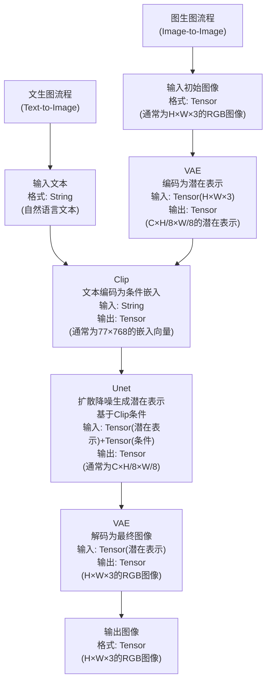

```dotnetcli

可以使用conda创建虚拟环境 和 python env的区别在于 会包含C++的库和功能 默认保存在c盘
(base) PS D:\nanoGPT> conda activate nanoGPT
(nanoGPT) PS D:\nanoGPT> conda info --envs

# conda environments:
#
nanoGPT              * C:\Users\Admin\.conda\envs\nanoGPT
base                   D:\anaconda3
```


flux重复选择1即可
- Epoch：模型看数据的“遍数”。多则学得深，但可能过拟合；少则学得浅，可能欠拟合。
- 学习率：模型学习的“步幅”。高则学得快，但可能不稳；低则学得慢，但更稳定。
- Batch Size 决定了每次参数更新时模型处理的训练样本数量，越大越快但不稳，越小越稳但训练时间更长。


```
在项目目录下创建并激活虚拟环境
python -m venv venv
venv\Scripts\activate  
pip install -r requirements.txt

注释 python可以替换为"C:\Program Files\Python311\python.exe"这样env中的依赖默认使用指定python
```

```
使用py的时候 优先激活当前项目的python
.\.venv\Scripts\Activate.ps1
输入 (Get-Command python).Source 可以查看当前python路径
```


```
新建一个bat文件 可以命名为activate_env.bat 内容如下 即可在当前目录中激活虚拟环境来运行项目 默认会打开cmd窗口 更方便
@echo off
call G:\Finetune\kohya_ss\venv\Scripts\activate
cmd /k
```

```
或者新建一个bat文件 可以命名为run_kohya_gui.bat 内容如下 即可在当前目录中激活虚拟环境来运行项目 默认会打开cmd窗口 更方便
@echo off
call G:\Finetune\kohya_ss\venv\Scripts\activate
python kohya_gui.py
cmd /k
```





>
>激活函数将线性函数转换为非线性 能够更好的拟合现实世界
>为了解决神经网络中线性变换无法处理非线性问题的情况


>
>一层一个激活函数

>
>一层激活一层线性套套套就是一层＋一层 形成了前向传播


>
>神经网络训练就是从x1和x2中猜到w1,w2,b1,b2


>
>
>均方误差：以样本数均分误差的平方


偏导数求导可视化

>#### 代码和3d也是一样的 不要总是自己造轮子 要使用现成的工具和代码来实现自己想要的东西
>#### 竞争力往往体现在 组装能力 / 把控能力 / 创新能力
>#### 解决一类问题而不是一个问题
>- **SDK** 预备工具包，给厨师提供现成的刀具和食材。
>- **MCP Server**: 厨房智能助手，用sdk工具箱工具做菜 提供成品给你
>- **MCP Client**: 顾客，向server点菜等成品
>- **API**: 打开烤箱 而不是自己生火  
>- **MCP Protocol**: 菜单 点菜格式，定沟通规则。
>- **npx**: “一次性厨具出租”，临时用别人准备好的烹饪工具（包），用完就还回去，无需自己安装。  
>- **npm**: “食材市场”，提供各种现成代码包（食材），让厨师（开发者）可以挑拣并存到自己的厨房（项目）里。  
>- **Docker**: “移动厨房”，把整个烹饪环境（代码、工具、设置）打包成一个便携箱，随搬随做
>- **NumPy**: “数学厨具套装”，为厨师（开发者）提供高效工具（数组和数学函数），快速处理数据
- **网络退化**：层数加深后，网络性能变差，因为信息传递失真，就像悄悄话传到最后跑题，**残差连接**像开条直通车让信息快速到达。  
- **梯度消失**：反向传播中梯度变小，深层参数不更新，像水流过滤网后只剩滴水，**ReLU激活**像换上大孔网让水流畅通。
---

- **预训练Pre-Train**集合互联网**全部海量知识** 耗时 几个月
- **后训练Fine-Tune中的-SFT**学习人工标注数据 **对话助手**专门训练 耗时 几天 人来赋予基模个性化
- **强化学习RLHF** 选择黄色的最优路径 并调整模型参数 *Reinforcement Learning*
 
 RL的威力如下
 

##### 三者构成了LLM
*RLHF让模型出现了反思Token 确保回答准确性 在deepseek论文中* 


#### DeepSeek论文核心观点
1. **纯RL激发推理**：自发形成推理能力,Token数量暴增
2. **GRPO创新**：Group Relative Policy Optimization，群体评分优化策略，高效低成本。
3. **推理自进化**：Aha时刻出现“顿悟”，自优化显著提升表现。
4. **多阶段优化**：结合少量初始数据+多轮RL，改善语言混杂，推理媲美o1。
5. **蒸馏传承**：监督微调将推理能力高效转移至小模型。


---

>#### Model需要Token来思考
>- 使用use code是最准确的

>- 或让回答的计算结果后置在回答的**末端**可以:
>  - 充分利用神经元(多走几遍神经元流程)(回答的字数/**Token更多**)(**靠心算**)
>  - 使得回答更准确而非直接给出结果(使用很**少Token**)(**靠猜**)
>  - Model只能看到**Token** 而无法看到**字符** 所以幼稚的错误


>**NumPy**：适合数值计算，尤其是多维数组和矩阵操作。
>**OpenCV**：专注于图像和视频处理，功能强大且实用。

矩阵是二维数据 张量可以是更多维度数据 所以RGB图象可以用张量表示
8x8 像素的 RGB 图像H, W, C 实际存储形式
[
  [[10, 5, 2], [20, 10, 4], [30, 15, 6], [40, 20, 8], [50, 25, 10], [60, 30, 12], [70, 35, 14], [80, 40, 16]],  # 第1行
  [[11, 6, 3], [21, 11, 5], [31, 16, 7], [41, 21, 9], [51, 26, 11], [61, 31, 13], [71, 36, 15], [81, 41, 17]],  # 第2行
  [[12, 7, 4], [22, 12, 6], [32, 17, 8], [42, 22, 10], [52, 27, 12], [62, 32, 14], [72, 37, 16], [82, 42, 18]],  # 第3行
  [[13, 8, 5], [23, 13, 7], [33, 18, 9], [43, 23, 11], [53, 28, 13], [63, 33, 15], [73, 38, 17], [83, 43, 19]],  # 第4行
  [[14, 9, 6], [24, 14, 8], [34, 19, 10], [44, 24, 12], [54, 29, 14], [64, 34, 16], [74, 39, 18], [84, 44, 20]],  # 第5行
  [[15, 10, 7], [25, 15, 9], [35, 20, 11], [45, 25, 13], [55, 30, 15], [65, 35, 17], [75, 40, 19], [85, 45, 21]],  # 第6行
  [[16, 11, 8], [26, 16, 10], [36, 21, 12], [46, 26, 14], [56, 31, 16], [66, 36, 18], [76, 41, 20], [86, 46, 22]],  # 第7行
  [[17, 12, 9], [27, 17, 11], [37, 22, 13], [47, 27, 15], [57, 32, 17], [67, 37, 19], [77, 42, 21], [87, 47, 23]]   # 第8行
]
转为张量并归一化后

tensor([
  # R 通道 (红色通道)
  [[0.0392, 0.0784, 0.1176, 0.1569, 0.1961, 0.2353, 0.2745, 0.3137],
   [0.0431, 0.0824, 0.1216, 0.1608, 0.2000, 0.2392, 0.2784, 0.3176],
   [0.0471, 0.0863, 0.1255, 0.1647, 0.2039, 0.2431, 0.2824, 0.3216],
   [0.0510, 0.0902, 0.1294, 0.1686, 0.2078, 0.2471, 0.2863, 0.3255],
   [0.0549, 0.0941, 0.1333, 0.1725, 0.2118, 0.2510, 0.2902, 0.3294],
   [0.0588, 0.0980, 0.1373, 0.1765, 0.2157, 0.2549, 0.2941, 0.3333],
   [0.0627, 0.1020, 0.1412, 0.1804, 0.2196, 0.2588, 0.2980, 0.3373],
   [0.0667, 0.1059, 0.1451, 0.1843, 0.2235, 0.2627, 0.3020, 0.3412]],

  # G 通道 (绿色通道)
  [[0.0196, 0.0392, 0.0588, 0.0784, 0.0980, 0.1176, 0.1373, 0.1569],
   [0.0235, 0.0431, 0.0627, 0.0824, 0.1020, 0.1216, 0.1412, 0.1608],
   [0.0275, 0.0471, 0.0667, 0.0863, 0.1059, 0.1255, 0.1451, 0.1647],
   [0.0314, 0.0510, 0.0706, 0.0902, 0.1098, 0.1294, 0.1490, 0.1686],
   [0.0353, 0.0549, 0.0745, 0.0941, 0.1137, 0.1333, 0.1529, 0.1725],
   [0.0392, 0.0588, 0.0784, 0.0980, 0.1176, 0.1373, 0.1569, 0.1765],
   [0.0431, 0.0627, 0.0824, 0.1020, 0.1216, 0.1412, 0.1608, 0.1804],
   [0.0471, 0.0667, 0.0863, 0.1059, 0.1255, 0.1451, 0.1647, 0.1843]],

  # B 通道 (蓝色通道)
  [[0.0078, 0.0157, 0.0235, 0.0314, 0.0392, 0.0471, 0.0549, 0.0627],
   [0.0118, 0.0196, 0.0275, 0.0353, 0.0431, 0.0510, 0.0588, 0.0667],
   [0.0157, 0.0235, 0.0314, 0.0392, 0.0471, 0.0549, 0.0627, 0.0706],
   [0.0196, 0.0275, 0.0353, 0.0431, 0.0510, 0.0588, 0.0667, 0.0745],
   [0.0235, 0.0314, 0.0392, 0.0471, 0.0549, 0.0627, 0.0706, 0.0784],
   [0.0275, 0.0353, 0.0431, 0.0510, 0.0588, 0.0667, 0.0745, 0.0824],
   [0.0314, 0.0392, 0.0471, 0.0549, 0.0627, 0.0706, 0.0784, 0.0863],
   [0.0353, 0.0431, 0.0510, 0.0588, 0.0667, 0.0745, 0.0824, 0.0902]]
])


---
#### 魔术方法

##### __getitem__案例
```
import os
from PIL import Image

class SimpleImageDataset:
    def __init__(self, data_dir, label_dir):  # 初始化，接收数据目录和标签目录
        self.data_dir = data_dir  # 设置数据目录路径
        self.label_dir = label_dir  # 设置标签目录路径
        self.image_files = os.listdir(data_dir)  # 列出目录下所有图像文件

    def __getitem__(self, idx):  # 定义 __getitem__，根据索引返回数据
        img_name = self.image_files[idx]  # 根据索引获取图像文件名
        img_path = os.path.join(self.data_dir, img_name)  # 组合完整图像路径
        image = Image.open(img_path)  # 打开图像
        label = os.path.join(self.label_dir, img_name.replace(".jpg", ".txt"))  # 假设标签是同名 .txt 文件
        return image, label  # 返回图像和对应标签

# 使用示例
dataset = SimpleImageDataset("/path/to/images", "/path/to/labels")
image, label = dataset[0]  # 通过索引 0 获取第一个图像和标签
```

```
class NumberSequence:
    def __init__(self, numbers):  # 初始化，接收一个数字列表
        self.numbers = numbers  # 存储数字列表作为属性

    def __getitem__(self, idx):  # 定义 __getitem__，根据索引返回数字
        return self.numbers[idx]  # 返回列表中对应索引的数字

# 使用示例
sequence = NumberSequence([10, 20, 30, 40, 50])
print(sequence[2])  # 输出: 30
print(sequence[0])  # 输出: 10
```


__xxx__ 是魔术方法 本质就是函数 为了和普通函数区分开 所以加上了双下划线

| 特殊方法       | 用途                                      |
|----------------|-------------------------------------------|
| `__init__`     | 初始化对象，设置类属性（如数据集路径）        |
| `__len__`      | 返回数据集或对象的长度，用于 `len()`         |
| `__getitem__`  | 根据索引获取数据项，支持索引访问（如 `dataset[idx]`） |
| `__call__`     | 使对象可调用，如模型的前向传播               |
| `__repr__`     | 返回对象的字符串表示，用于调试和显示         |
| `__str__`      | 返回对象的简洁字符串描述，用于打印          |
| `__setattr__`  | 控制属性设置行为，用于自定义属性赋值逻辑      |
| `__getattr__`  | 控制属性访问行为，用于动态返回属性           |
| `__eq__`       | 定义对象相等性比较，用于 `==` 操作          |
| `__add__`      | 定义对象相加行为，用于 `+` 操作（如张量操作） |
| `__torch_function__` | 自定义张量操作行为，扩展 PyTorch 功能       |  
  


##### __init__定义案例

```
class SimpleImageDataset: #类本身
    def __init__(self, data_dir, label_dir):  # 定义 __init__，接收数据目录和标签目录作为参数
        self.data_dir = data_dir  # 设置数据目录路径作为实例属性
        self.label_dir = label_dir  # 设置标签目录路径作为实例属性
        self.image_files = os.listdir(data_dir)  # 列出数据目录下的所有图像文件，存储为列表

使用示例
dataset = SimpleImageDataset("/path/to/images", "/path/to/labels") #实例化一个具体的类
```

```
import torch
import torch.nn as nn

class SimpleNN: #类本身
    def __init__(self, input_size=10, hidden_size=20, output_size=2):  # 定义 __init__，接收网络层大小作为参数
        self.layer1 = nn.Linear(input_size, hidden_size)  # 初始化第一层线性层
        self.layer2 = nn.Linear(hidden_size, output_size)  # 初始化第二层线性层
        self.activation = nn.ReLU()  # 初始化激活函数

 使用示例
model = SimpleNN(input_size=10, hidden_size=20, output_size=2) #实例化一个具体的类
```

**def -init-(self, ...) self 总是第一个参数，表示当前实例(mydataset) 将类的实例（对象）和初始化时的参数关联起来，为新创建的类实例设置初始状态或属性**

---


Pytorch
1.使用anaconda prompt 输入 conda activate pytorch 打开pytorch环境
2.然后anaconda prompt 输入 jupyter notebook 打开jupyter notebook


|  类型        |  描述                   |
|-------------|------------------------|
|  ML（机器学习）分为以下三种 |  =  DL（深度学习）     |
|  CNN（卷积神经网络） |  主要处理图像        |
|  RNN（循环神经网络） |  主要处理文本        |
|  GAN（对抗神经网络） |  生成图片            |
|  Auto-Encoder（自编码器） |  生成            |
|  Transformer() |  chatgpt            |
| 原理示意| |
|  此图对应上图 一个小圆 |  |

anaconda就是管理环境的工具


conda和pip是并列概念 都是包的安装工具

>**梯度下降**是优化模型的核心算法，通过不断更新参数来最小化损失函数。
**收敛**是判断算法是否达到最佳状态的标准，确保训练过程的有效性。
**正态分布**在初始化、引入随机性和假设检验等方面发挥着重要作用，帮助模型更好地学习和泛化。


魔术方法===私有属性
示例-add- 来赋予Menu可加性👇
```
class Menu:
    def __init__(self, items):
        self.items = items

    def __add__(self, other):
        return Menu(self.items + other.items)

menu1 = Menu(["披萨"])
menu2 = Menu(["意大利面"])
combined_menu = menu1 + menu2
print(combined_menu.items)  # 输出: ['披萨', '意大利面']
```
```
class Restaurant:
    def __init__(self, name):
        self.name = name

    def __str__(self):
        return f"Restaurant: {self.name}"

# 示例
rest = Restaurant("美味餐厅")
print(rest)  # 输出: Restaurant: 美味餐厅
```

>这里的__len__相当于给Menu赋予了长度属性 从而len可以识别其长度,👇
```
class Menu:
    def __init__(self, items):
        self.items = items

    def __len__(self):   
        return len(self.items)

# 示例
menu = Menu(["披萨", "意大利面", "沙拉"])
print(len(menu))  # 输出: 3
```

print()会自动调用--str--属性

>类 餐馆模板
对象 麦当劳连锁店
实例 海淀麦当劳1号店


>pip：Python 的包管理工具
conda: 包管理工具 但不限于python


*不同的pytorch版本*

类是对象的蓝图，对象是类的实例
python面向对象编程，具有封装，继承，多态等特性，继承就是儿子获得爸爸属性，多态就是不同的人(对象)可以同一个妓女(方法，接口)
vex面向过程
AI相关
高精需求
- 生成贴图
- 生成背景和其他物件（喂精致的
- 先做精致然后扩图
vae编码~行李打包
vae解码~行李拆包
可以用大模型（搬家公司）的vae袋子也可以用自己找的vae
图像可以通过vae编码为latent潜在空间（行李空间）
采样器的降噪就是重绘幅度

latent直接缩放等同于ps放大图片，需要再采样重绘一次


```Python
# 定义class可以理解为在定义班长self，然后与班长对接，用.链接不同同学
class Engine:
    def __init__(self, horsepower):
        self.horsepower = horsepower

class Car:
    def __init__(self, brand, engine):
        self.brand = brand
        self.engine = engine

# 创建Engine实例和Car实例
my_engine = Engine(250)
my_car = Car("Toyota", my_engine)

# 使用点号进行链式访问
print(my_car.engine.horsepower)  # 输出: 250
```

API python用法
1.在json和py存放目录输入powershell启动powershell 2.启动python 3.操作具体的那个py
注意：json是接口文件，py才是脚本文件


| **概念**        | **描述**                                           |
|-----------------|----------------------------------------------------|
| **cuDNN** **TensorRT**      | NVIDIA深度学习加速库，优化神经网络**工具本身**  |
| **CUDA**        | NVIDIA 利用 GPU 加速计算。 **工具箱**   |
| **TensorFlow** **PyTorch**  | 机器学习框架**建筑蓝图包含工具箱**    |
| **Conda**  **Chocolatey (choco)**     | 包管理和环境管理工具，用于创建和管理虚拟环境。 **工具箱架子**   |
| **环境变量**     | 指引系统找工具和库   **路线图** |


**卷积层**：提取输入数据特征的神经网络层。
**梯度**：描述损失函数变化率的数学工具，推动模型优化。
| 概念         | 比喻                                   | 作用                                      | 常用文件名称       | 文件格式说明       |
|--------------|----------------------------------------|-------------------------------------------|--------------------|--------------------|
| 权重         | 果汁中水果和水的比例                   | 决定最终的味道                            | weights.npy        | NumPy 数组文件，用于存储权重值 |
| 卷积层       | 制作果汁时使用的工具                   | 提取输入数据的不同特征                  | conv_layer.py      | Python 文件，定义卷积层的实现 |
| 潜在空间     | 所有果汁汇聚的大碗                     | 表示不同果汁的特征                       | latent_space.pkl    | Pickle 文件，存储潜在空间的特征 |
| 梯度         | 调整果汁味道的过程                     | 指导如何改进配方，以减少损失             | gradients.csv       | CSV 文件，记录梯度值和更新信息 |
