| 模型       | 输入数据格式                                                                 | 输出数据格式                                                                 |
|------------|-----------------------------------------------------------------------------|-----------------------------------------------------------------------------|
| **VAE**    | 图像张量 <br>`[batch_size, channels, height, width]`，如 `[B, 3, 64, 64]`<br>或一维向量（对于非图像数据） | 潜在表示（低维向量，<br>如 `[B, latent_dim]`） |
| **CLIP**   | 图像张量 <br>`[batch_size, 3, height, width]`，如 `[B, 3, 224, 224]`<br>和/或文本（tokenized 序列，<br>如 `[B, seq_len]`） | 图像嵌入向量<br>（如 `[B, embed_dim]`）<br>和/或文本嵌入向量<br>（如 `[B, embed_dim]`） |
| **ViT**    | 图像张量<br> `[batch_size, 3, height, width]`，如 `[B, 3, 224, 224]`，<br>分块为 patches） | 分类 logits<br>（如 `[B, num_classes]`）<br>或特征嵌入<br>（如 `[B, embed_dim]`） |
| **DiT**    | 潜在表示张量<br> `[batch_size, channels, height, width]`，<br>通常来自 VAE 编码） | 生成的潜在表示<br>（同输入格式，<br>形如 `[B, C, H, W]`，<br>需解码为图像） |
| **Diffusion** | 噪声图像张量<br> `[batch_size, channels, height, width]`，<br>如 `[B, 3, 256, 256]`）<br>或潜在表示（若为 latent diffusion） | 去噪后的图像<br>（同输入格式，<br>如 `[B, 3, 256, 256]`）<br>或潜在表示 |

| 方面         | Embedding     由 CLIP、ViT 等模型产生                         | Latent  由 VAE、Diffusion 编码器产生                              |
|--------------|----------------------------------------|---------------------------------------|
| **样子**     | 一串固定长度的数字<br>`[0.23, -0.45, ...]`（512 个数字复杂度） | 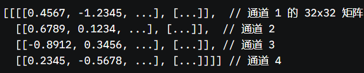 4096个数字复杂度 |
| **用途**     | 为了比较、分类、检索<br>“这张图是不是猫？” | 为了重建、生成<br>“画一张猫的图！”        |
| **例子**     | CLIP 的 `[1, 512]`，表示“猫的特征”      | VAE 的 `[1, 128]`，表示“猫的蓝图”     |
| **比喻**     | 一张写满标签的“名片”，高度抽象         | 一个能还原图的“压缩包”                |


 |向量线性变换的特征1 | 向量线性变换的特征2 |
|-------|-------|
|  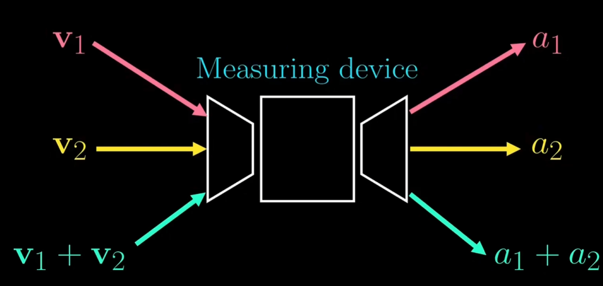     | 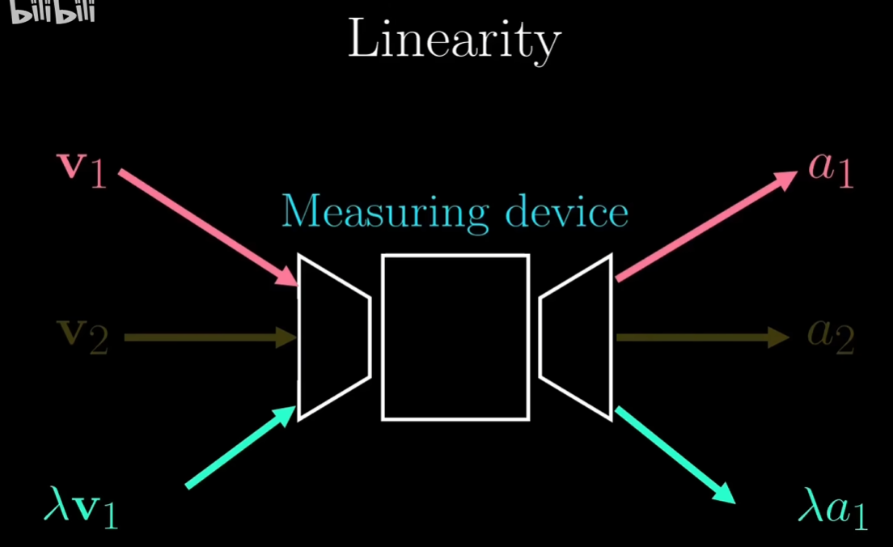      |

>Softmax 使用 exp 因为：
>· 保证输出非负，适合概率表示。
>· 放大输入差异，形成尖锐的概率分布。
>· 便于归一化，和为 1。
>· 数学性质（如导数简单）便于优化。
>· 与对数概率模型天然兼容。

类可以保存状态 所以用于创建实例，可以包含函数和属性


参数 = 参数 + 学习率 * 梯度

(3, 256, 256)经过64个卷积核处理可以为 (64, 128, 128) 即64个特征图 
如果卷积核步幅Stride为4 那么输出为(64, 64, 64) 
如果池化窗口为2x2 步幅为2 那么输出为(3, 128, 128) 

**正态分布假设**：VAE强加正态分布作为潜在空间先验，便于计算和生成新数据。  
**图像差异性**：每张图像通过编码器生成独特的 μ 和 σ，保留个性化的正态分布。  
**z 的格式**：z 是tensor，且 z = μ + σ * ε 所有参数维度一致 
**解码还原**：Flatten后的1维tensor784 进入Encoder处理 压缩为2个1维tensor(128维度的u和128维的方差6) 然后通过z = 均值u + 标准差6 * 随机噪声e 生成z(同样128维) 


---

### 训练 Encoder  \( Q_\phi(z|x) \) 过程


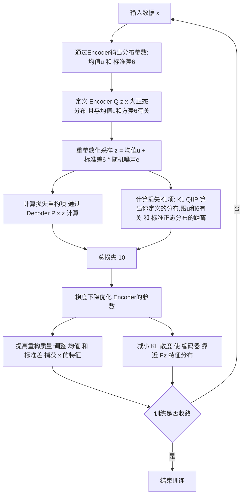

### 前置知识


#### 概率基础

- 任一分布**概率密度函数PDF** 包括正态分布 的积分等于1

- 对于随机变量 和的期望等于各自期望的和
\[
E[\log(AB)] = E[\log(A)] + E[\log(B)]
\]


#### 期望定义 \( E_{p(B)}[p(A)] = \int p(A) \cdot p(B) \, dB \)
- 含义：计算 \( p(A) \) 在 \( p(B) \) 分布下的期望。假设 \( A \) 和 \( B \) 独立，期望就是 \( p(A) \)。

#### 链式法则  \( p(x, z) = p(x) \cdot p(z|x) \)
- 含义：联合概率等于边缘概率乘以条件概率，描述 \( X \) 和 \( Z \) 的关系。

---

### **重点概念**

生成图片的过程可以描述为两步：  

1. **采样潜在变量**：从先验分布 \(p(z)\) 中采样一个 \(z\)。  
2. **生成图片**：根据条件分布 \(p(x|z)\) 用 \(z\) 生成图片 \(x\)。  

这就使得图片 \(x\) 的概率表达为：  
\[
p(x) = \int p(x|z)p(z)\,dz
\]
这里的积分意味着我们考虑了所有可能的 \(z\) 值对生成 \(x\) 的贡献，因为我们并不知道真实生成图片时 \(z\) 的具体值。换句话说，积分操作是对所有可能的“生成方式”求和，从而得到 \(x\) 的整体生成概率。

**假设图片数据 x 可由某个隐含因素 z生成** (服从某个先验分布 P(z)) 故有:

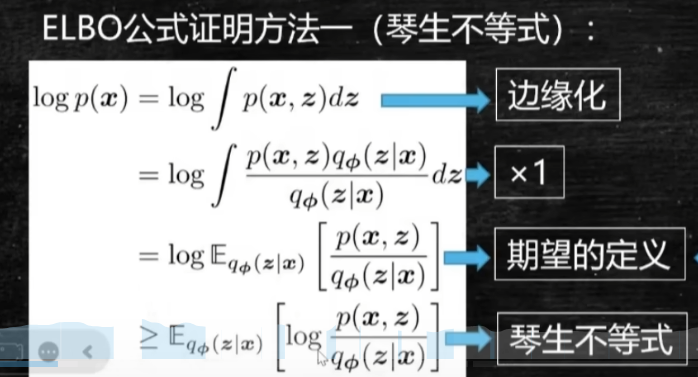

- **ELBO 公式**  
\[
\log P(x) = \log \mathbb{E}_{Q_\phi(z|x)} \left[ \frac{P(x, z)}{Q_\phi(z|x)} \right] + KL(Q_\phi(z|x) || P(z))
\]  
\[
\log P(x) = \text{ELBO} + \text{KL 散度}   
\]  
故有 **ELBO**:  
\[
\log P(x) \geq \mathbb{E}_{Q_\phi(z|x)} \left[ \log \frac{P(x, z)}{Q_\phi(z|x)} \right]
\]  
展开为：  
\[
\mathbb{E}_{Q_\phi(z|x)} \left[ \log \frac{P(x, z)}{Q_\phi(z|x)} \right] = \mathbb{E}_{Q_\phi(z|x)} [\log P(x|z)] - KL(Q_\phi(z|x) || P(z))
\]  

- **重构项**：\( \mathbb{E}_{Q_\phi(z|x)} [\log P(x|z)] \)  
   - **含义**：衡量从潜在特征 \( z \) 重建照片 \( x \) 的质量。  
   - **形象解释**：画家用“特征种子”画照片，画得越像原图，分数越高。
   - 让 \( z \) 能重建 \( x \)（编码器猜得准）。**是衡量Decoder  \( P_\theta(x|z) \) 效果的指标**

- **KL 散度**：\( KL(Q_\phi(z|x) || P(z)) \)  
  - 表示 \( Q_\phi(z|x) \) 和 \( P(z) \) 的差异  
  - **含义**：比较“猜测的特征分布” \( Q_\phi(z|x) \) 和“标准特征分布” \( P(z) \) 的差异。  
  - **形象解释**：检查侦探猜的特征是不是太离谱，越接近标准模板（KL 越小），说明编码器越靠谱。
  - 让 \( Q_\phi(z|x) \) 接近先验 \( P(z) \)（猜测别太离谱）。

- **训练 \( Q_\phi(z|x) \) 的过程 = 优化整个 ELBO**，
  - 因为 \( Q_\phi(z|x) \) 同时影响重构项 **Decoder 和 KL 散度**。
  - 最大化 ELBO = 提高重构质量（画得像） + 减小 KL 散度（猜得准）。  
  - **形象解释**：让“Decoder画家”画的照片更像原图，同时让“Encoder侦探”猜的潜在特征更接近标准模板。

- **梯度下降**：优化模型参数 \( \phi \) 
  - 提高重构质量（调整 \( \mu \) 和 \( \sigma \) 捕获 \( x \) 特征）。
  - 减小 KL 散度（使 \( Q_\phi(z|x) \) 靠近 P(z)  128维的标准正态分布）。


### VAE和扩散模型差异?
- VAE 通过潜空间 \( z \) 压缩和生成，扩散模型通过时间序列的加噪和去噪过程直接操作数据空间 \( x \)。
- VAE 像“侦探+画家”：侦探猜特征（\( Q(z|x) \)），画家根据特征画图（\( P(x|z) \)），目标是让画接近真实照片。
- 扩散模型像“修图师”：先把照片涂满噪声，然后一步步擦干净，每次擦的时候猜下一步该怎么修（\( P(x_{t-1} | x_t) \)），最终还原真实照片。


---

| 名称                      | 解释                                                                                                                                                                                                                                                                                                                                                     |
| :------------------------ | :------------------------------------------------------------------------------------------------------------------------------------------------------------------------------------------------------------------------------------------------------------------------------------------------------------------------------------------------------- |
| **\( P_\phi(x) \)** <br>   **边际似然 / 图片概率分数**     | - **定义**：表示图片 \( x \) 在 VAE 模型下的概率。单个标量（e.g., \( 10^{-5} \)），衡量图片“合理性”。 <br> - **直观**：不是图片本身，而是模型认为图片“有多可能”。 <br> - **实际**：VAE 的训练目标是最大化数据的边际似然 \( P_\phi(x) \)，\( P_\phi(x) \) 高说明潜在变量 \( z \) 抓住了关键特征，重建更接近原图，因此总概率高是目标。 <br> - **表达式**： 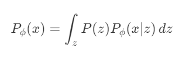 <br> - **计算**：VAE 优化模型参数试图最大化 \( P_\phi(x) \) 但直接优化 \( P_\phi(x) \) 不可行，因为 \( z \) 是高维很难计算，所以使用变分推断。 |
| **\( P(x) \)**  <br> **真实图像分布 \( P(x) \)**          | - **状态**：可定义但是难以计算 <br> - **性质**：绝对真理。 <br> - **描述**：真实世界中图像的概率分布，仅通过样本（如照片数据集）间接观测。 <br> - **形象解释**：想象一堆真实的照片，\( P(x) \) 是这些照片背后隐藏的“生成规律”，我们无法直接写出来。                                                                                                                                      |
| **\( P(z) \)** <br> **先验潜在分布 \( P(z) \)**           | - **状态**：人为定义。 <br> - **性质**：是一个PDF，而不是一个具体的值。人为设定的简单分布，如标准正态分布 \( N(0,1) \)。**特征分布, 特征结构**。 <br> - **形象解释**：一个“随机种子库”，比如一堆模糊的“特征模板”，用来给生成过程提供起点。 <br> - **补充**：它是高维的（比如 128 维），但形式简单，由我们手动定义，不是从照片中学来的。                                                                                              |
| **\( P(z\|x) \)** <br> **真实条件分布** (真实后验)        | - **状态**：未知的、不可表的。 <br> - **形象解释**：给定一张具体照片 \( x \)（如猫图），它的潜在特征 \( z \)（如“猫的轮廓、毛色”）的真实分布。太复杂，无法直接计算。                                                                                                                                                                   |
| **\( P(x, z) \)** <br> **真实联合分布 \( P(x, z) \)**        | - **状态**：未知的、不可表的。 <br> - **形象解释**：描述“某张照片 \( x \) 和它的潜在特征 \( z \) 同时出现”的可能性。 <br> - **数学关系**： \( P(x, z) = P(x) \cdot P(z\|x) \) 或 \( P(z) \cdot P(x\|z) \) <br> - **示例**：P(猫图和猫特征) = P(猫图) * P(猫特征\|猫图)。                                                                                                     |
| **\( Q_\phi(z\|x) \)** <br> **Encoder  训练目标:变分分布 \( Q_\phi(z\|x) \)** (近似后验)        | - **状态**：已知的（训练后）、可表的。 <br> - **性质**：经验真理 (通过训练得到)。 <br> - **作用**：通过照片 \( x \) 推测潜在特征 \( z \) 的分布，用数据集样本训练。 <br> - **形象解释**：编码器像个“侦探”，看到照片后猜它的“潜在特征”（如“这是猫的形状”）。                                                                                                                       |
| **\( P_\phi(x\|z) \)** <br> **Decoder 训练目标:变分分布 \( P_\phi(x\|z) \)** (似然)        | - **性质**：经验真理 (通过训练得到)。 <br> - **作用**：通过潜在特征 \( z \) 重建照片 \( x \)，使模型生成的 \( P(x) \) 接近真实分布。 <br> - **形象解释**：解码器像个“画家”，根据“潜在特征”画出照片，目标是画得跟原图越像越好。                                                                                                                                                 |

交叉熵损失本质上是 KL 散度的一种形式（忽略常数项），它度量预测分布 \( y \) 和真实分布 \( y \) 的差异。

#### 变分推断干啥？
- **目的**：近似计算和优化 \( P_\phi(x) \)，绕过难解的积分。
- **方法**：
  1. 引入简单分布 \( Q_\theta(z|x) \)（e.g., 正态分布），近似后验 \( P(z|x) \)。
  2. 优化 ELBO：
     - 重建项：\( \mathbb{E}_{Q_\theta(z|x)}[\log P_\phi(x|z)] \)，提升重建质量。
     - KL 项：\( KL(Q_\theta(z|x) || P(z)) \)，正则化 \( Q_\theta(z|x) \) 靠近先验。
- **操作**：编码器输出 \( \mu, \sigma \) → 采样 \( z \) → 解码器重建 \( x \) → 优化 ELBO。
- **结果**：间接推高 \( P_\phi(x) \)，学会图片分布。

---


#### VAE为啥通过输出均值 \( \mu \) 和方差 \( \sigma^2 \) 再生成 \( z \)？
- **可微性(暂时理解为可导 )**：重参数化 \( z = \mu + \sigma \cdot \epsilon \)（\( \epsilon \sim N(0, 1) \)），隔离随机性到 \( \epsilon \)，让 \( \mu \) 和 \( \sigma \) 可优化 **(单次训练并且可微是\( \mu \) 和 \( \sigma^2 \) )**
- **连续性**：\( \mu \) 和 \( \sigma^2 \) 定义分布，使潜在空间平滑，支持生成多样性和插值。
- **正则化**：KL 散度强制 \( N(\mu, \sigma^2) \) 接近 \( N(0, 1) \)，保持空间结构。
- **总结**：解决优化、增强生成能力、维持结构。使得模型更加健壮 适应不同的 \( \epsilon \)

####  \( \epsilon \)采样如何随机？
- **过程**：
  1. 编码器输出 \( \mu \) 和 \( \sigma \)（常从 \( \log \sigma^2 \) 计算）。
  2. 从 \( N(0, 1) \) 采样随机噪声 \( \epsilon \)。
  3. \( z = \mu + \sigma \cdot \epsilon \)。
- **随机性**：\( \epsilon \) 每次独立采样，导致 \( z \) 数值变化，但分布符合 \( N(\mu, \sigma^2) \)。
- **例子**：\( \mu = [0.5, -1] \)，\( \sigma = [0.2, 0.3] \)，\( \epsilon = [0.1, -0.2] \) → \( z = [0.52, -1.06] \)。
- \( \mu \) 和 \( \sigma^2 \) 设计让 \( z \) 可优化且连续，采样靠随机 \( \epsilon \) **(真随机 不更新参数)** 实现多样性。
- 在单次训练中， \( \epsilon \) 是固定的


---


| **问题**                | **KL 散度**                                      | **交叉熵**                                      | **额外说明**                              |
|-------------------------|------------------------------------------------|------------------------------------------------|------------------------------------------|
| **定义**                | D_KL(pII q) = Σ p(x) * log(p(x) / q(x))       | H(p, q) = -Σ p(x) * log(q(x))                  | H(p, q) = H(p) + D_KL(p II q)  并且有熵的定义     H(p) = -Σ p(x) * log(p(x))       |
| **特点**                | 不对称，非负，0 时分布相同                     | 直接度量预测分布的误差                         | KL 是交叉熵的一部分，去掉 H(p)            |
| **用途**                | 分布逼近（如 VAE）                            | 分类损失函数                                  | H(p) 为常数依赖真实分布 交叉熵 = 原熵 + KL散度                                  |


|        | **VAE**                          | **CLIP**                          |
|--------|----------------------------------|-----------------------------------|
| **输入** | 图像: `[batch, 3, H, W]` (如 `[32, 3, 64, 64]`) | 图像: `[batch, 3, 224, 224]` <br> 文本: `[batch, seq_len]` (如 `[32, 77]`) |
| **输出**都是高维数据精华 | Latent: `[batch, latent_dim]` (如 `[32, 128]`) <br> 重构图像: `[batch, 3, H, W]`是变量 | Embedding: `[batch, embed_dim]` (如 `[32, 512]`) 是确定的向量|

- 数据类型均为 float32 张量。
- VAE 的 latent 包含均值 μ 和方差 σ，CLIP 的 embedding 用于图像-文本相似度计算。

| **有监督学习**                          | **无监督学习**                          |
|-----------------------------------------|-----------------------------------------|
| **数据**：(x, y)，其中x表示样本，y表示标签 | **数据**：x，其中x为数据               |
| **学 x -> y 的映射**                  | **学结构**                            |
| **例子**：分类，回归，目标              | **例子**：聚类，降维，特                |
| **检测**，语言分割等等                  | **征学习**，密度估计等                  |
>**贝叶斯核心**：用新证据更新信念。  
>**公式**：P(A|B) = [P(B|A) × P(A)] / P(B)  *分子部分为似然(包含了先验信息) 分母为标准化常数*
>- 下雨概率20%（P(下雨)=0.2）。  
>- 下雨时乌云90%（P(乌云|下雨)=0.9），不下雨时乌云30%（P(乌云|不下雨)=0.3）。  
>- 看到乌云后：P(下雨|乌云) = (0.9 × 0.2) / (0.9 × 0.2 + 0.3 × 0.8) = 0.18 / 0.42 ≈ 42.9%。  

>**精髓**：从20%（初始猜测）到42.9%（新判断），贝叶斯像“天平”，用乌云线索重新平衡可能性。

自回归是一种概念:**将n步输出 作为n+1步输入**

| 模型       | 架构                          | 特性                         | 输出             | 主要作用与应用场景                  |
|------------|-------------------------------|------------------------------|---------------------------|-------------------------------------|
| GPT        | Transformer Decoder-only     | 单向自回归，理解靠数据和自注意力 | 生成文本      | 偏生成对话，面向消费者 (toC)         |
| BERT       | Transformer Encoder-only     | 双向模型，专注句子理解       | 依任务而定（如 768 维）   | 偏理解任务，面向专业应用 (toB)       |
| T5-XXL     | 完整 Transformer (Encoder-Decoder) | 双向编码+生成，擅复杂语义 | 4096 维序列嵌入          | 在扩散模型中将文本转为向量，指导生成 |
| CLIP-L     | 多模态模型 (Transformer-based) | 视觉-文本对齐，固定向量   | 768 或 1024 维固定向量    | 在扩散模型中提供视觉相关嵌入         |


---


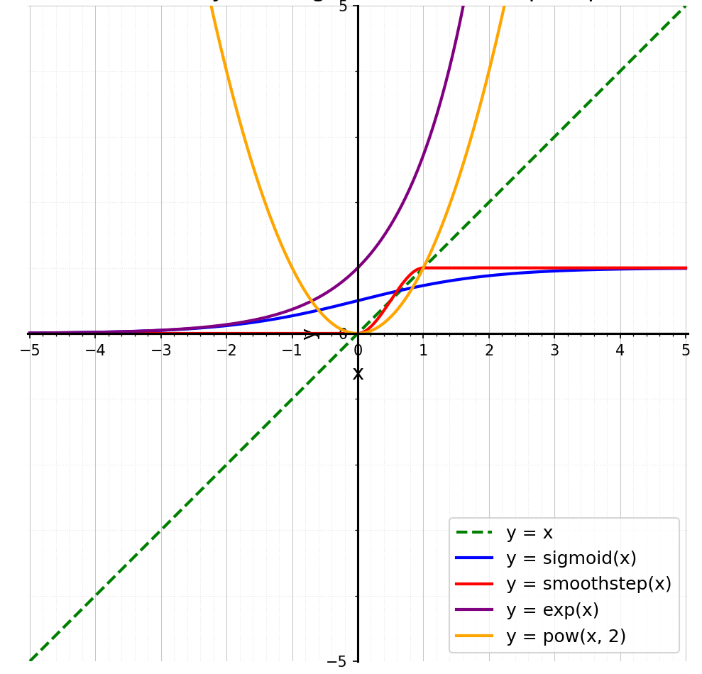

>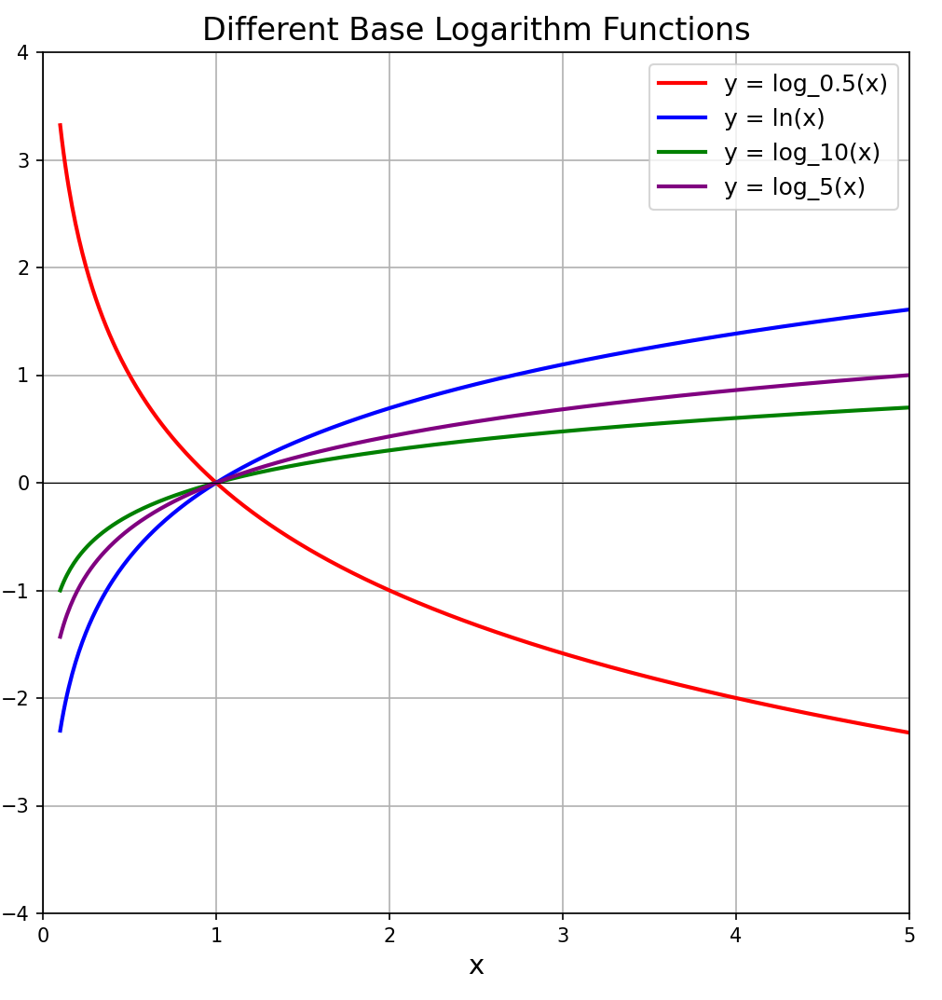
>log函数可以将0-1的值映射到负无穷到0,一般用于放大微小数值方便处理 

>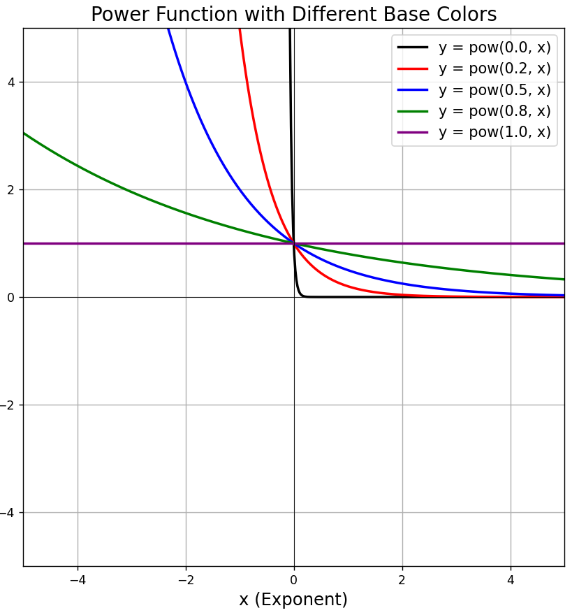
>Pow中x参数越接近0,所有值就被拉向1,越增大,所有值就被拉向0

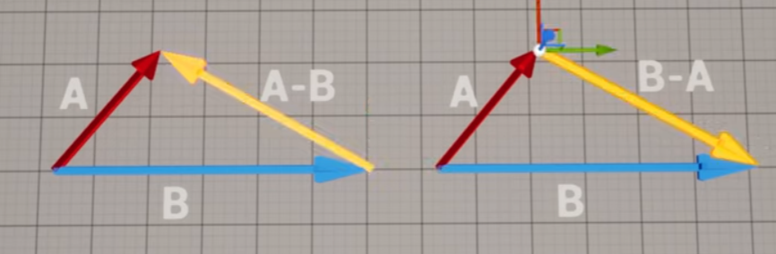

>可以理解为输入和输出都是数组 并且输出概率加起来为1 **让突出的更加突出**
>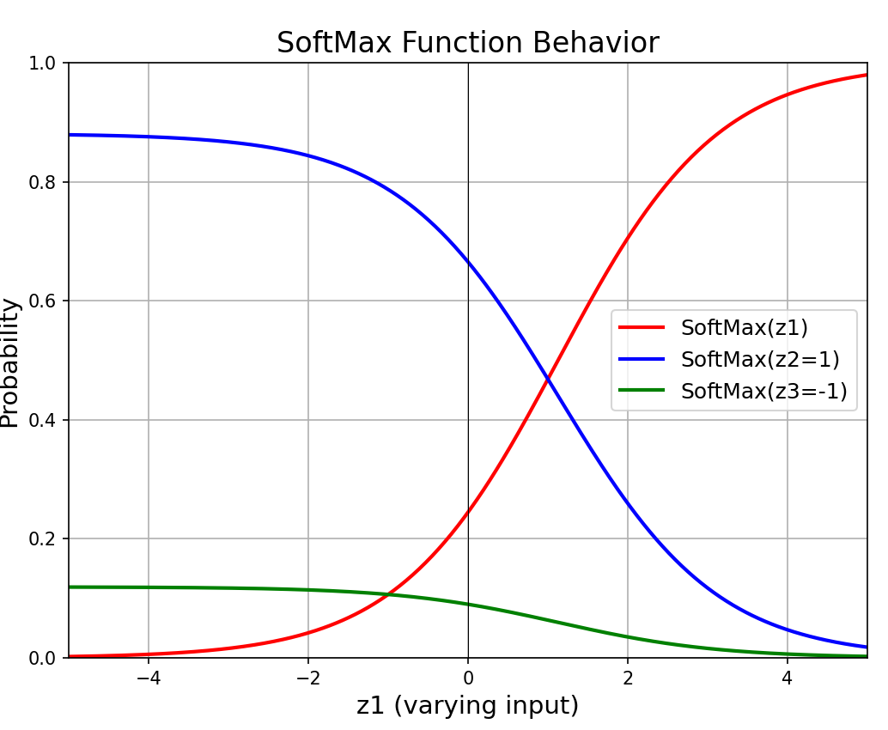

---


```dotnetcli

可以使用conda创建虚拟环境 和 python env的区别在于 会包含C++的库和功能 默认保存在c盘
conda create --name ENV_NAME
(base) PS D:\nanoGPT> conda activate nanoGPT
(nanoGPT) PS D:\nanoGPT> conda info --envs

# conda environments:
#
nanoGPT              * C:\Users\Admin\.conda\envs\nanoGPT
base                   D:\anaconda3
```


flux重复选择1即可
- Epoch：模型看数据的“遍数”。多则学得深，但可能过拟合；少则学得浅，可能欠拟合。
- 学习率：模型学习的“步幅”。高则学得快，但可能不稳；低则学得慢，但更稳定。
- Batch Size 决定了每次参数更新时模型处理的训练样本数量，越大越快但不稳，越小越稳但训练时间更长。


```
在项目目录下创建并激活虚拟环境
python -m venv venv
venv\Scripts\activate  
pip install -r requirements.txt

注释 python可以替换为"C:\Program Files\Python311\python.exe"这样env中的依赖默认使用指定python
```

```
使用py的时候 优先激活当前项目的python
.\.venv\Scripts\Activate.ps1
输入 (Get-Command python).Source 可以查看当前python路径
```


```
新建一个bat文件 可以命名为activate_env.bat 内容如下 即可在当前目录中激活虚拟环境来运行项目 默认会打开cmd窗口 更方便
@echo off
call G:\Finetune\kohya_ss\venv\Scripts\activate
cmd /k
```

```
或者新建一个bat文件 可以命名为run_kohya_gui.bat 内容如下 即可在当前目录中激活虚拟环境来运行项目 默认会打开cmd窗口 更方便
@echo off
call G:\Finetune\kohya_ss\venv\Scripts\activate
python kohya_gui.py
cmd /k
```


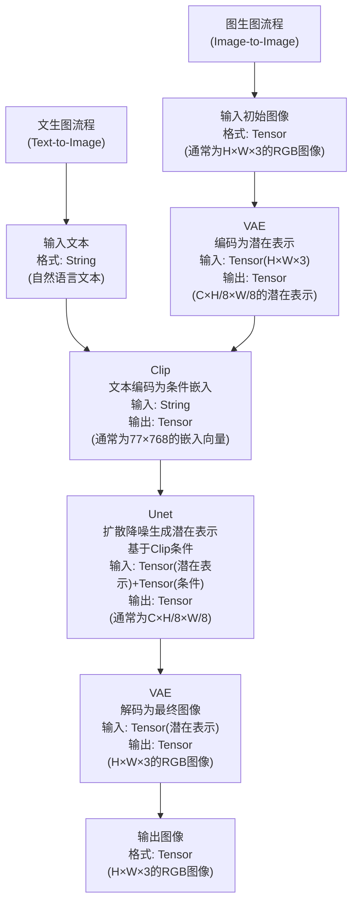


>
>激活函数将线性函数转换为非线性 能够更好的拟合现实世界
>为了解决神经网络中线性变换无法处理非线性问题的情况


>
>一层一个激活函数

>
>一层激活一层线性套套套就是一层＋一层 形成了前向传播


>
>神经网络训练就是从x1和x2中猜到w1,w2,b1,b2


>
>
>均方误差：以样本数均分误差的平方


偏导数求导可视化

>#### 代码和3d也是一样的 不要总是自己造轮子 要使用现成的工具和代码来实现自己想要的东西
>#### 竞争力往往体现在 组装能力 / 把控能力 / 创新能力
>#### 解决一类问题而不是一个问题
>- **SDK** 预备工具包，给厨师提供现成的刀具和食材。
>- **MCP Server**: 厨房智能助手，用sdk工具箱工具做菜 提供成品给你
>- **MCP Client**: 顾客，向server点菜等成品
>- **API**: 打开烤箱 而不是自己生火  
>- **MCP Protocol**: 菜单 点菜格式，定沟通规则。
>- **npx**: “一次性厨具出租”，临时用别人准备好的烹饪工具（包），用完就还回去，无需自己安装。  
>- **npm**: “食材市场”，提供各种现成代码包（食材），让厨师（开发者）可以挑拣并存到自己的厨房（项目）里。  
>- **Docker**: “移动厨房”，把整个烹饪环境（代码、工具、设置）打包成一个便携箱，随搬随做
>- **NumPy**: “数学厨具套装”，为厨师（开发者）提供高效工具（数组和数学函数），快速处理数据
- **网络退化**：层数加深后，网络性能变差，因为信息传递失真，就像悄悄话传到最后跑题，**残差连接**像开条直通车让信息快速到达。  
- **梯度消失**：反向传播中梯度变小，深层参数不更新，像水流过滤网后只剩滴水，**ReLU激活**像换上大孔网让水流畅通。
---

- **预训练Pre-Train**集合互联网**全部海量知识** 耗时 几个月
- **后训练Fine-Tune中的-SFT**学习人工标注数据 **对话助手**专门训练 耗时 几天 人来赋予基模个性化
- **强化学习RLHF** 选择黄色的最优路径 并调整模型参数 *Reinforcement Learning*
 
 RL的威力如下
 

##### 三者构成了LLM
*RLHF让模型出现了反思Token 确保回答准确性 在deepseek论文中* 


#### DeepSeek论文核心观点
1. **纯RL激发推理**：自发形成推理能力,Token数量暴增
2. **GRPO创新**：Group Relative Policy Optimization，群体评分优化策略，高效低成本。
3. **推理自进化**：Aha时刻出现“顿悟”，自优化显著提升表现。
4. **多阶段优化**：结合少量初始数据+多轮RL，改善语言混杂，推理媲美o1。
5. **蒸馏传承**：监督微调将推理能力高效转移至小模型。


---

>#### Model需要Token来思考
>- 使用use code是最准确的

>- 或让回答的计算结果后置在回答的**末端**可以:
>  - 充分利用神经元(多走几遍神经元流程)(回答的字数/**Token更多**)(**靠心算**)
>  - 使得回答更准确而非直接给出结果(使用很**少Token**)(**靠猜**)
>  - Model只能看到**Token** 而无法看到**字符** 所以幼稚的错误


>**NumPy**：适合数值计算，尤其是多维数组和矩阵操作。
>**OpenCV**：专注于图像和视频处理，功能强大且实用。

矩阵是二维数据 张量可以是更多维度数据 所以RGB图象可以用张量表示
8x8 像素的 RGB 图像H, W, C 实际存储形式
[
  [[10, 5, 2], [20, 10, 4], [30, 15, 6], [40, 20, 8], [50, 25, 10], [60, 30, 12], [70, 35, 14], [80, 40, 16]],  # 第1行
  [[11, 6, 3], [21, 11, 5], [31, 16, 7], [41, 21, 9], [51, 26, 11], [61, 31, 13], [71, 36, 15], [81, 41, 17]],  # 第2行
  [[12, 7, 4], [22, 12, 6], [32, 17, 8], [42, 22, 10], [52, 27, 12], [62, 32, 14], [72, 37, 16], [82, 42, 18]],  # 第3行
  [[13, 8, 5], [23, 13, 7], [33, 18, 9], [43, 23, 11], [53, 28, 13], [63, 33, 15], [73, 38, 17], [83, 43, 19]],  # 第4行
  [[14, 9, 6], [24, 14, 8], [34, 19, 10], [44, 24, 12], [54, 29, 14], [64, 34, 16], [74, 39, 18], [84, 44, 20]],  # 第5行
  [[15, 10, 7], [25, 15, 9], [35, 20, 11], [45, 25, 13], [55, 30, 15], [65, 35, 17], [75, 40, 19], [85, 45, 21]],  # 第6行
  [[16, 11, 8], [26, 16, 10], [36, 21, 12], [46, 26, 14], [56, 31, 16], [66, 36, 18], [76, 41, 20], [86, 46, 22]],  # 第7行
  [[17, 12, 9], [27, 17, 11], [37, 22, 13], [47, 27, 15], [57, 32, 17], [67, 37, 19], [77, 42, 21], [87, 47, 23]]   # 第8行
]
转为张量并归一化后

tensor([
  # R 通道 (红色通道)
  [[0.0392, 0.0784, 0.1176, 0.1569, 0.1961, 0.2353, 0.2745, 0.3137],
   [0.0431, 0.0824, 0.1216, 0.1608, 0.2000, 0.2392, 0.2784, 0.3176],
   [0.0471, 0.0863, 0.1255, 0.1647, 0.2039, 0.2431, 0.2824, 0.3216],
   [0.0510, 0.0902, 0.1294, 0.1686, 0.2078, 0.2471, 0.2863, 0.3255],
   [0.0549, 0.0941, 0.1333, 0.1725, 0.2118, 0.2510, 0.2902, 0.3294],
   [0.0588, 0.0980, 0.1373, 0.1765, 0.2157, 0.2549, 0.2941, 0.3333],
   [0.0627, 0.1020, 0.1412, 0.1804, 0.2196, 0.2588, 0.2980, 0.3373],
   [0.0667, 0.1059, 0.1451, 0.1843, 0.2235, 0.2627, 0.3020, 0.3412]],

  # G 通道 (绿色通道)
  [[0.0196, 0.0392, 0.0588, 0.0784, 0.0980, 0.1176, 0.1373, 0.1569],
   [0.0235, 0.0431, 0.0627, 0.0824, 0.1020, 0.1216, 0.1412, 0.1608],
   [0.0275, 0.0471, 0.0667, 0.0863, 0.1059, 0.1255, 0.1451, 0.1647],
   [0.0314, 0.0510, 0.0706, 0.0902, 0.1098, 0.1294, 0.1490, 0.1686],
   [0.0353, 0.0549, 0.0745, 0.0941, 0.1137, 0.1333, 0.1529, 0.1725],
   [0.0392, 0.0588, 0.0784, 0.0980, 0.1176, 0.1373, 0.1569, 0.1765],
   [0.0431, 0.0627, 0.0824, 0.1020, 0.1216, 0.1412, 0.1608, 0.1804],
   [0.0471, 0.0667, 0.0863, 0.1059, 0.1255, 0.1451, 0.1647, 0.1843]],

  # B 通道 (蓝色通道)
  [[0.0078, 0.0157, 0.0235, 0.0314, 0.0392, 0.0471, 0.0549, 0.0627],
   [0.0118, 0.0196, 0.0275, 0.0353, 0.0431, 0.0510, 0.0588, 0.0667],
   [0.0157, 0.0235, 0.0314, 0.0392, 0.0471, 0.0549, 0.0627, 0.0706],
   [0.0196, 0.0275, 0.0353, 0.0431, 0.0510, 0.0588, 0.0667, 0.0745],
   [0.0235, 0.0314, 0.0392, 0.0471, 0.0549, 0.0627, 0.0706, 0.0784],
   [0.0275, 0.0353, 0.0431, 0.0510, 0.0588, 0.0667, 0.0745, 0.0824],
   [0.0314, 0.0392, 0.0471, 0.0549, 0.0627, 0.0706, 0.0784, 0.0863],
   [0.0353, 0.0431, 0.0510, 0.0588, 0.0667, 0.0745, 0.0824, 0.0902]]
])


---
#### 魔术方法

##### __getitem__案例
```
import os
from PIL import Image

class SimpleImageDataset:
    def __init__(self, data_dir, label_dir):  # 初始化，接收数据目录和标签目录
        self.data_dir = data_dir  # 设置数据目录路径
        self.label_dir = label_dir  # 设置标签目录路径
        self.image_files = os.listdir(data_dir)  # 列出目录下所有图像文件

    def __getitem__(self, idx):  # 定义 __getitem__，根据索引返回数据
        img_name = self.image_files[idx]  # 根据索引获取图像文件名
        img_path = os.path.join(self.data_dir, img_name)  # 组合完整图像路径
        image = Image.open(img_path)  # 打开图像
        label = os.path.join(self.label_dir, img_name.replace(".jpg", ".txt"))  # 假设标签是同名 .txt 文件
        return image, label  # 返回图像和对应标签

# 使用示例
dataset = SimpleImageDataset("/path/to/images", "/path/to/labels")
image, label = dataset[0]  # 通过索引 0 获取第一个图像和标签
```

```
class NumberSequence:
    def __init__(self, numbers):  # 初始化，接收一个数字列表
        self.numbers = numbers  # 存储数字列表作为属性

    def __getitem__(self, idx):  # 定义 __getitem__，根据索引返回数字
        return self.numbers[idx]  # 返回列表中对应索引的数字

# 使用示例
sequence = NumberSequence([10, 20, 30, 40, 50])
print(sequence[2])  # 输出: 30
print(sequence[0])  # 输出: 10
```


__xxx__ 是魔术方法 本质就是函数 为了和普通函数区分开 所以加上了双下划线

| 特殊方法       | 用途                                      |
|----------------|-------------------------------------------|
| `__init__`     | 初始化对象，设置类属性（如数据集路径）        |
| `__len__`      | 返回数据集或对象的长度，用于 `len()`         |
| `__getitem__`  | 根据索引获取数据项，支持索引访问（如 `dataset[idx]`） |
| `__call__`     | 使对象可调用，如模型的前向传播               |
| `__repr__`     | 返回对象的字符串表示，用于调试和显示         |
| `__str__`      | 返回对象的简洁字符串描述，用于打印          |
| `__setattr__`  | 控制属性设置行为，用于自定义属性赋值逻辑      |
| `__getattr__`  | 控制属性访问行为，用于动态返回属性           |
| `__eq__`       | 定义对象相等性比较，用于 `==` 操作          |
| `__add__`      | 定义对象相加行为，用于 `+` 操作（如张量操作） |
| `__torch_function__` | 自定义张量操作行为，扩展 PyTorch 功能       |  
  


##### __init__定义案例

```
class SimpleImageDataset: #类本身
    def __init__(self, data_dir, label_dir):  # 定义 __init__，接收数据目录和标签目录作为参数
        self.data_dir = data_dir  # 设置数据目录路径作为实例属性
        self.label_dir = label_dir  # 设置标签目录路径作为实例属性
        self.image_files = os.listdir(data_dir)  # 列出数据目录下的所有图像文件，存储为列表

使用示例
dataset = SimpleImageDataset("/path/to/images", "/path/to/labels") #实例化一个具体的类
```

```
import torch
import torch.nn as nn

class SimpleNN: #类本身
    def __init__(self, input_size=10, hidden_size=20, output_size=2):  # 定义 __init__，接收网络层大小作为参数
        self.layer1 = nn.Linear(input_size, hidden_size)  # 初始化第一层线性层
        self.layer2 = nn.Linear(hidden_size, output_size)  # 初始化第二层线性层
        self.activation = nn.ReLU()  # 初始化激活函数

 使用示例
model = SimpleNN(input_size=10, hidden_size=20, output_size=2) #实例化一个具体的类
```

**def -init-(self, ...) self 总是第一个参数，表示当前实例(mydataset) 将类的实例（对象）和初始化时的参数关联起来，为新创建的类实例设置初始状态或属性**

---


Pytorch
1.使用anaconda prompt 输入 conda activate pytorch 打开pytorch环境
2.然后anaconda prompt 输入 jupyter notebook 打开jupyter notebook


|  类型        |  描述                   |
|-------------|------------------------|
|  ML（机器学习）分为以下三种 |  =  DL（深度学习）     |
|  CNN（卷积神经网络） |  主要处理图像        |
|  RNN（循环神经网络） |  主要处理文本        |
|  GAN（对抗神经网络） |  生成图片            |
|  Auto-Encoder（自编码器） |  生成            |
|  Transformer() |  chatgpt            |
| 原理示意| |
|  此图对应上图 一个小圆 |  |

anaconda就是管理环境的工具


conda和pip是并列概念 都是包的安装工具

>**梯度下降**是优化模型的核心算法，通过不断更新参数来最小化损失函数。
**收敛**是判断算法是否达到最佳状态的标准，确保训练过程的有效性。
**正态分布**在初始化、引入随机性和假设检验等方面发挥着重要作用，帮助模型更好地学习和泛化。


魔术方法===私有属性
示例-add- 来赋予Menu可加性👇
```
class Menu:
    def __init__(self, items):
        self.items = items

    def __add__(self, other):
        return Menu(self.items + other.items)

menu1 = Menu(["披萨"])
menu2 = Menu(["意大利面"])
combined_menu = menu1 + menu2
print(combined_menu.items)  # 输出: ['披萨', '意大利面']
```
```
class Restaurant:
    def __init__(self, name):
        self.name = name

    def __str__(self):
        return f"Restaurant: {self.name}"

# 示例
rest = Restaurant("美味餐厅")
print(rest)  # 输出: Restaurant: 美味餐厅
```

>这里的__len__相当于给Menu赋予了长度属性 从而len可以识别其长度,👇
```
class Menu:
    def __init__(self, items):
        self.items = items

    def __len__(self):   
        return len(self.items)

# 示例
menu = Menu(["披萨", "意大利面", "沙拉"])
print(len(menu))  # 输出: 3
```

print()会自动调用--str--属性

>类 餐馆模板
对象 麦当劳连锁店
实例 海淀麦当劳1号店


>pip：Python 的包管理工具
conda: 包管理工具 但不限于python


*不同的pytorch版本*

类是对象的蓝图，对象是类的实例
python面向对象编程，具有封装，继承，多态等特性，继承就是儿子获得爸爸属性，多态就是不同的人(对象)可以同一个妓女(方法，接口)
vex面向过程
AI相关
高精需求
- 生成贴图
- 生成背景和其他物件（喂精致的
- 先做精致然后扩图
vae编码~行李打包
vae解码~行李拆包
可以用大模型（搬家公司）的vae袋子也可以用自己找的vae
图像可以通过vae编码为latent潜在空间（行李空间）
采样器的降噪就是重绘幅度

latent直接缩放等同于ps放大图片，需要再采样重绘一次


```Python
# 定义class可以理解为在定义班长self，然后与班长对接，用.链接不同同学
class Engine:
    def __init__(self, horsepower):
        self.horsepower = horsepower

class Car:
    def __init__(self, brand, engine):
        self.brand = brand
        self.engine = engine

# 创建Engine实例和Car实例
my_engine = Engine(250)
my_car = Car("Toyota", my_engine)

# 使用点号进行链式访问
print(my_car.engine.horsepower)  # 输出: 250
```

API python用法
1.在json和py存放目录输入powershell启动powershell 2.启动python 3.操作具体的那个py
注意：json是接口文件，py才是脚本文件


| **概念**        | **描述**                                           |
|-----------------|----------------------------------------------------|
| **cuDNN** **TensorRT**      | NVIDIA深度学习加速库，优化神经网络**工具本身**  |
| **CUDA**        | NVIDIA 利用 GPU 加速计算。 **工具箱**   |
| **TensorFlow** **PyTorch**  | 机器学习框架**建筑蓝图包含工具箱**    |
| **Conda**  **Chocolatey (choco)**     | 包管理和环境管理工具，用于创建和管理虚拟环境。 **工具箱架子**   |
| **环境变量**     | 指引系统找工具和库   **路线图** |


**卷积层**：提取输入数据特征的神经网络层。
**梯度**：描述损失函数变化率的数学工具，推动模型优化。
| 概念         | 比喻                                   | 作用                                      | 常用文件名称       | 文件格式说明       |
|--------------|----------------------------------------|-------------------------------------------|--------------------|--------------------|
| 权重         | 果汁中水果和水的比例                   | 决定最终的味道                            | weights.npy        | NumPy 数组文件，用于存储权重值 |
| 卷积层       | 制作果汁时使用的工具                   | 提取输入数据的不同特征                  | conv_layer.py      | Python 文件，定义卷积层的实现 |
| 潜在空间     | 所有果汁汇聚的大碗                     | 表示不同果汁的特征                       | latent_space.pkl    | Pickle 文件，存储潜在空间的特征 |
| 梯度         | 调整果汁味道的过程                     | 指导如何改进配方，以减少损失             | gradients.csv       | CSV 文件，记录梯度值和更新信息 |
