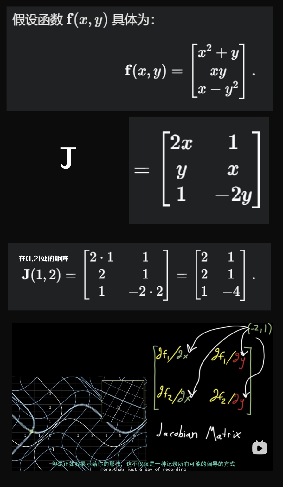

##### 雅可比矩阵我理解作用就是快速得到某处的梯度 

雅可比矩阵在优化过程中的贡献可以精炼为以下几点：

###  **局部线性化与变化预测**：
   雅可比矩阵描述损失函数在 \((1, 2)\) 附近的局部行为。
   对于损失函数 \(L(x, y)\)（例如定义为 \(\mathbf{f}(x, y)\) 与目标值 \(\mathbf{c}\) 的误差平方和 \(L = \|\mathbf{f}(x, y) - \mathbf{c}\|^2\)），其梯度近似为：
   \[
   \nabla L \approx 2 \mathbf{J}^T (\mathbf{f}(x, y) - \mathbf{c}),
   \]
   **其他类型的损失函数 也可以写成雅可比矩阵和误差向量的乘积 只是可能和上述公式不同**

   其中 \(\mathbf{J}(1, 2) = \begin{bmatrix} 2 & 1 \\ 2 & 1 \\ 1 & -4 \end{bmatrix}\)。这允许快速计算输入变化 \(\Delta \mathbf{x} = [\Delta x, \Delta y]^T\) 对损失的影响：
   \[
   \Delta \mathbf{f} \approx \mathbf{J} \cdot \Delta \mathbf{x}.
   \]
   例如，若目标是 \(\mathbf{c} = [3, 2, -3]\)，在 \((1, 2)\) 处，\(\mathbf{f}(1, 2) = [3, 2, -3]\)，误差为零，但若输入略偏离，雅可比矩阵可预测误差如何变化，指导下一步调整。

### **优化方向与步长**：
   在梯度下降中，雅可比矩阵提供梯度方向，优化 \(x, y\) 以最小化损失。例如，梯度 \(\nabla L \approx 2 \mathbf{J}^T (\mathbf{f} - \mathbf{c})\) 表明如何调整 \(x, y\) 使 \(\mathbf{f}\) 更接近目标。若误差非零，更新规则为：
   \[
   \mathbf{x}_{k+1} = \mathbf{x}_k - \eta \mathbf{J}^T (\mathbf{f}(\mathbf{x}_k) - \mathbf{c}),
   \]
   其中 \(\eta\) 是学习率。Xk+1可以理解为Xk的更新后参数 雅可比矩阵 \(\mathbf{J}(1, 2)\) 的元素（例如第三行 \([1, -4]\)）显示 \(y\) 对 \(f_3 = x - y^2\) 的影响远大于 \(x\)，因此优化时应优先调整 \(y\) 以高效降低 \(f_3\) 的误差。

