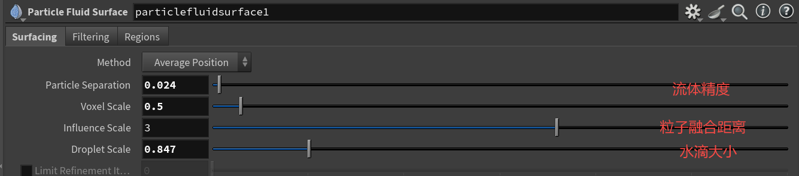
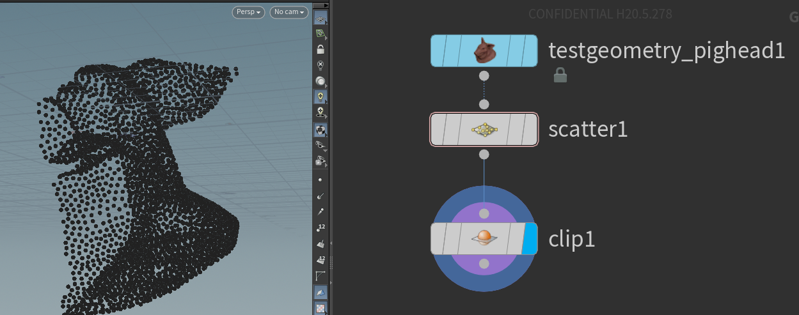

>编辑资产参数思路:主电缆 副电缆 模拟(优化)

>螺旋线制作方法 扭转扫描

叉乘前normalize记得

>程序化切割平面(xz平面)

>addprim使用过程:

>用循环: 逐个处理、复杂逻辑、动态生成。
不用循环: 统一操作、内置函数批量处理。

| 属性  | 数据类型 | 单位         | 特点                          |
|-------|----------|--------------|-------------------------------|
| Age   | float    | 秒（seconds）| 表示粒子当前生命时间，随时间增加。 |
| Life  | float    | 秒（seconds）| 表示粒子的最大生命期，决定粒子存活时间。 |
| Time  | float    | 秒（seconds）| 表示场景的全局时间，从开始到当前帧的时间。 |

>粒子life experiency默认以秒为单位
popvop需要手动选取input

fields ≈ attribute

>
*使用popfluid将粒子转换为流体    **粒子流→液态粒子流**

>
*接上图  **液态粒子流→液态网格**

>
 *这里的星号是乘（）是判断*

>
*dop网络最核心的结构

houdini导出给引擎需要**transform*50**

*blender导入houdini设置*

*sdf自带surface属性，fog自带density属性，polygon构成了mesh*

> ### houdini的大体思路：加减法控制变量➡乘法控制强度➡循环条件控制生长
> #### fit 中的src max一般就是控制range的（spread）

*vdb需要是封闭的网格否则出错*

>
*sdf可理解为距离vdb 而密度vdb就是云*

*方向覆盖（雪花，尘土等）原理如此简单：通过筛选法线角度 来指定Group*

set()用来定义向量（可以是二维或者三维）
类似python中的元组和列表（列表可变，元组不可变）

>
*属性随机化 和法定变量搭配使用*

*vertex和point的区别，前者更加底层*

>
*捕捉顶点组区域*

顶点组原理就是通过emu给了几何数据一个新的属性（布尔值属性）
#### 用houdini做粒子一定要做的立体，否则不如直接用材质解决

*注：Scatter只能读取面组，所以需要搭配grouppromote（转换点组为面组）来使用*

>
attribute属性就是编程中的变量如：p（xyz）index等等
enumerat遍历（也有说枚举的）总之就是可以给点添加编号

>
绿色为重点

