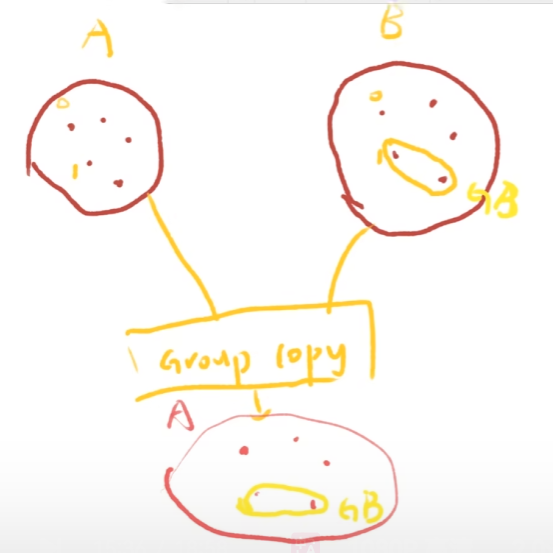
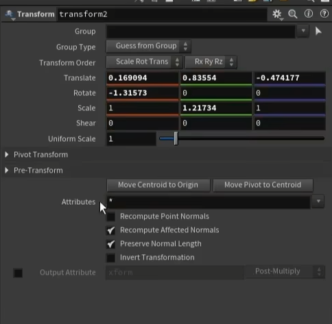

>##### UV相关
>**uvflatten**:侧重手动选择seams生成uv 两种算法
Spectral (SCP) 均匀展平，减少拉伸和扭曲。
Angle-Based (ABF) 保留角度，适合简单几何体。
>
>**uv autoseam**
Grain Islands 纹理孤岛
>
>**UV Unwrap**: 初步展开，创建UV坐标。
**UV Flatten**: 展开并优化已有UV，选项更多更好用。
>
>seams是houdini中缝合边的默认变量名
**uvlayout**专注于调整uv布局
**texel_density**专注于倍数调整uv大小（分辨率）
**export_uv_wireframe** 专注于导出uv线框图片到ps编辑

**uvproject**的几种投影方式
我理解就是将猪头贴到投影方式上
正投影，Orthographic；
极坐标，Polar；
圆柱体，Cylindrical；
环形，Toroidal；
保鲜膜，Plastic Wrap；

sweep节点可以生成uv数据 使用uv视图可以查看

| 节点名称       | 精炼说明                                       |
|----------------|------------------------------------------------|
| Pack           | 将几何体打包成独立的“Packed Primitive”，优化显示和内存，占用更少资源，支持实例化和局部变换。  |
| Merge          | 简单地合并多个几何流，不进行优化或打包，几何体仍保持完全可访问。  |
| Unpack         | 将打包的几何体解包回原始几何体，便于编辑。      |
| Connectivity    | 分析几何体的拓扑结构，为相连的元素分配唯一标识符。 |
| Partition      | 基于指定属性将几何体分割成多个组，便于管理和选择。 |
| Shrinkwrap     | 将几何体表面“收缩”到另一个几何体的表面上。      |
| Cluster Points  | 将点聚类到指定的中心点，便于组织和管理。        |
| Reverse(N)        | 反转几何体的法线方向，改变其朝向。Flip是所有属性              |
| UV Layout      | 生成一个优化后的UV坐标集，重新排列整个几何体的UV，以确保没有重叠并适合纹理贴图。  |
| UV Flatten      | 手动展uv  |
| Match Size     | 调整几何体的大小以匹配另一个几何体。            |
| Bound          | 创建一个包围盒，以包围给定的几何体。            |
| Split          | 将几何体分割为多个部分，基于指定条件。          |

>##### Groupbyrange:
>

>精简曲线不必要的点(polyframe生成切线法线)

facet减线点
poly reduce 减面

>Vellum Brush: 用于在模拟中通过画刷工具影响粒子位置和属性。
Vellum Constraints: 创建约束以控制粒子之间的关系。
Vellum Drape: 模拟布料下垂效果。
Vellum Glue: 用于连接粒子，模拟粘合效果。
Vellum Pack: 将多个Vellum对象打包为一个。
Vellum Solver: 处理Vellum模拟的核心计算。
Vellum Struts: 创建刚性支撑以增强结构稳定性。
Vellum Unpack: 解包已打包的Vellum对象。
Vellum Attach Constraints: 将约束附加到几何体上。

>Vellum Configure Balloon: 设置气球的物理属性。
Vellum Configure Cloth: 配置布料模拟的参数。
Vellum Configure Fluid: 设置流体模拟的属性。
Vellum Configure Grain: 配置颗粒模拟的参数。
Vellum Configure Hair: 设置头发模拟的属性。

>Vellum Constraint Properties: 调整约束的具体属性。
Vellum I/O: 处理Vellum数据的输入和输出。
Vellum Post-Process: 对模拟结果进行后处理。
Vellum Rest Blend: 混合Rest状态以平滑模拟。
Vellum Solver Minimal: 精简版的Vellum求解器，适用于简单模拟。
Vellum Stitch Points: 将点缝合在一起以形成连接。
Vellum Transform Pieces: 转换Vellum片段的位置和旋转。
Vellum Weld Points: 将点焊接在一起以形成固定连接。
Vellum Attach to Geometry: 将Vellum模拟附加到其他几何体上。
Vellum Configure Grain Pieces: 配置颗粒的物理属性和行为。

connect adjacent pieces链接相邻元素
convertline中的computelength生成的restlength属性 可以保留线段原始长度属性

矩阵或者某些属性可以挂载在Detail属性上而不是Point上
节省属性资源

| 函数                                   | 返回值                                       |
|----------------------------------------|--------------------------------------------|
| `getbbox(geometry)`                    | `((min_x, min_y, min_z), (max_x, max_y, max_z))` |
| `getbbox_center(geometry)`             | `(center_x, center_y, center_z)`          |
| `getbbox_size(geometry)`               | `(width, height, depth)`                   |
| `getbbox_min(geometry)`                | `(min_x, min_y, min_z)`                   |
| `getbbox_max(geometry)`                | `(max_x, max_y, max_z)`                   |
| `getpointbbox(geometry, point_index)`  | `((min_x, min_y, min_z), (max_x, max_y, max_z))` |

**smooth**本质就是对属性（包括P）进行平滑
**Normal**:生成法线
**Polyframe**：生成法线和（副）切线

> lookat1 核心工作原理是将一个方向向量转换为旋转矩阵。
输入：
from：这是 LookAt 操作的起点，通常是当前对象的位置。例如，你可以使用某个对象的位置信息作为起始点。
to：这是目标点，表示对象要“看向”的位置。这个输入通常是另一个对象的坐标或者点的位置。
up：表示世界的“向上”方向，这用于定义对象的“正面”方向在3D空间中的定向。默认情况下，这个值通常是世界坐标系的 (0, 1, 0)，即Y轴向上。但你可以自定义这个向量来控制对象的旋转方向。

输出的矩阵用途：
输出的矩阵（matx）通常用于下游节点中，用来修改对象的旋转、位置或者其他变换。矩阵表示的变换可以直接应用到几何体、实例化对象、骨骼等。通过矩阵，你可以高效地在3D空间中完成对象的对齐和旋转操作。

你可以将这个矩阵连接到下游的 Transform（变换）节点 或 实例化（instancing）节点，以便使用 LookAt 的结果来控制目标对象的朝向和旋转。

属性的改变用add，属性的强度（蒙版/动画）用muiltiply
>rampparameter节点的输出默认0-1
vop中的random节点默认输出0-1

在vop中，primuv和importpointattribute分别提取面/点的属性
scatter：尽量禁用relax iteration，拖慢速度；可以选用任意属性（如Cd）来决定点的密度
Fuse ：用于合并重叠的点，减少几何体中的点数。
Carve：用于在曲线上切割和提取部分几何
Width：设置宽度，通常与 polywire 结合使用，以便生成具有变化宽度的线条。
Polywire：用于将曲线或点云转换为带有宽度的几何体
Enumerate：只生成整数 ID。
AttribCreate：可以创建任意类型的属性（浮点、整型、矢量等）。
Group Copy：复制组信息（基于索引，两个模型需要本来就差不多）

Group Transfer：传递组信息（基于位置）
Group combine：a=a-b
sweep：以横截面生成曲线物体
clip：以指定xx裁剪，blast，直接删除

>Merge：简单合并
Object merge：引用外部的合并
Assemble：组装合并，赋予名称属性

使用**attribute visualize**来观察属性最好

>思路上，在最后控制V的强度
AttributeVop节点中可以对点进行删除操作 RemovePoints
同时用V和Force操控粒子的时，需指定just born group，这样两者不会互相干扰导致错误
在popsource中使用速度插值要更好一些（会有疏密），不过需要将速度继承调节为0

Pop source
emission attribute ：获取发射区域的msk
Impulse Activation：根据函数控制发射帧
- Fuse: 用于合并点，清理几何体，消除冗余。
- VDB Activate: 用于控制体积数据的激活状态，优化体积效果的处理。

*transform节点可以影响属性，表达式定义影响的属性*

在某一个节点中
