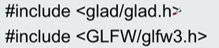
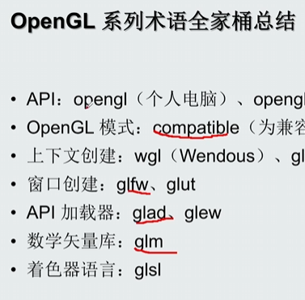
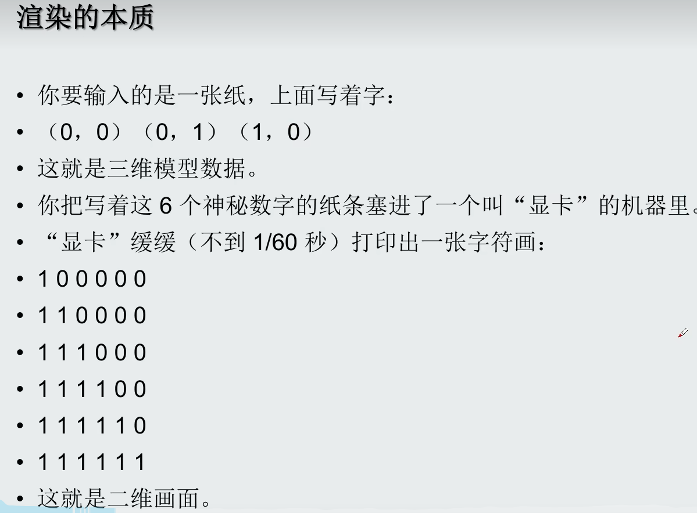

离线渲染：从眼睛发射线条 多次折射 直到消失 容易噪点
实时渲染：光栅化 只计算第一次反射

GPU特性：sin（x）函数类运算
CPU特性：if else 切换类逻辑类运算

*OpenGl API加载库 很常用 跟python的导入常用库一样*

### OSL（Open Shading Language）
- 用途：主要用于离线渲染和电影制作。
- 平台：广泛用于RenderMan和Arnold等渲染器。
- 特性：专注于高质量的纹理和材质定义。
### GLSL（OpenGL Shading Language）
- 用途：用于OpenGL中的实时渲染。
- 平台：跨平台，适用于Windows、macOS、Linux等。
- 特性：与OpenGL紧密集成，适合多种设备。
### HLSL（High-Level Shading Language）
- 用途：用于DirectX中的实时渲染。
- 平台：主要用于Windows平台。
- 特性：与DirectX紧密集成，适合高性能应用。

