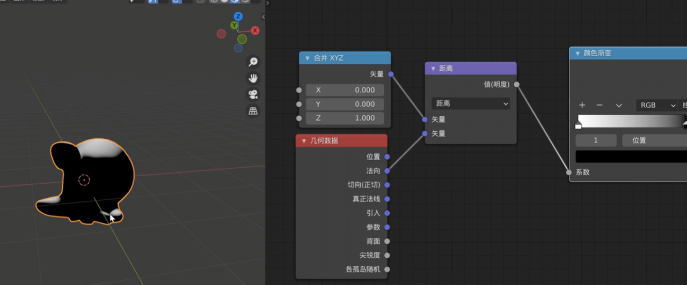
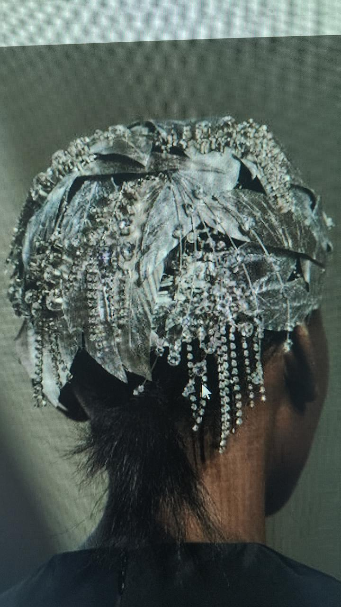
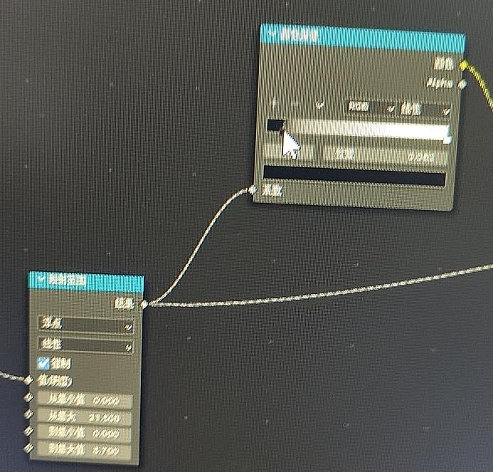
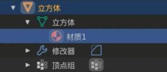
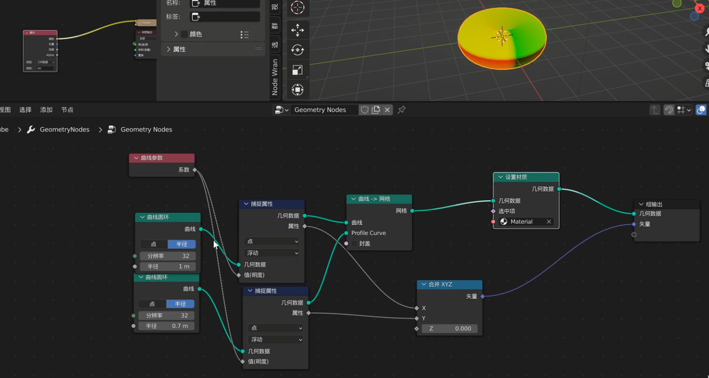
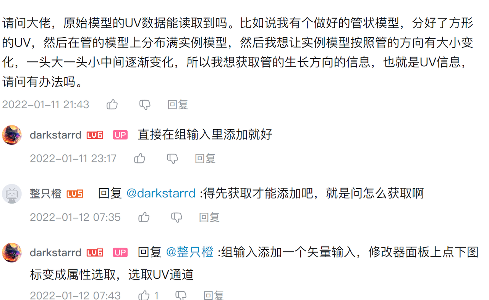
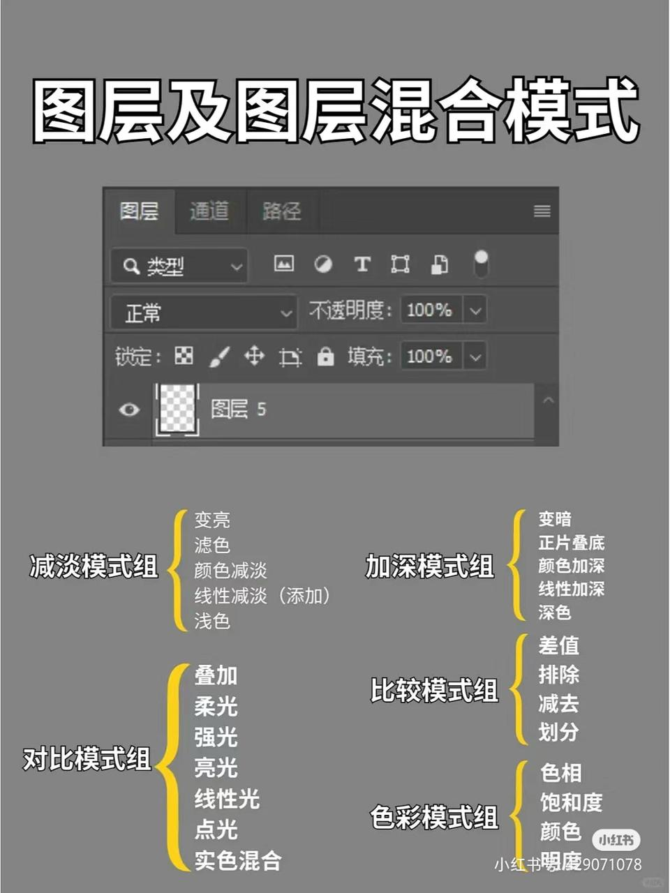

>
点 位置 缩放 方向
矢量 缩放 方向
法向 方向

法线贴图图片要选non color

Normalize: 单位向量a=向量a/llall

>blender几何节点模拟和houdini中solver类节点的区别
>Solver：逐帧累积，处理时间演化。
>Simulation：实时几何操作，独立计算每一帧。

**驱动器相关**
- 复制驱动器：函数（非数值）
- location（0）就是location（x）世界坐标x

**几何数据**里边的默认都是世界坐标
**纹理坐标**中的多是默认物体坐标

>矢量变换(矢量不仅有相对物体和世界的维度，还有以下这种信息携带维度）
>点 方向 大小 位置
>矢量 方向 大小（应该是几何数据和纹理坐标中默认的维度，也就是不包含点的位置信息）
>法向 方向

#### uv deform优势↑
层层折叠的（单纯凹凸置换做不到）
透明的（网格之类）
需要三维变换的（曲线变形做不到）

颜色渐变只能控制0-1的输入值，所以输入前需要加上映射范围（防止控制不到所有点）

累积场：输入是加上的值，针对每一个点的加法运算，给每一个点赋予一个新的属性（可以是编号，也可以是随机浮点或整数）
用法：缩放和位置需要联动的地方

计算60余弦：cos π/3
#### ./images/image fliter（材质节点）：
1.处理图片和蒙版 2.批量处理图片或者视频从而统一风格

除了调节拓扑，内插面也可以重定向

##### 法线已经可以和灯光互动了

几何数据~世界
纹理坐标~物体

##### 法向节点本质上就是可以产生任意方向的雪遮罩
（配合物体的法向输入）

##### 中心发射形纹理：几何数据 切向+沃罗诺伊

顶点颜色属于几何数据，
它既可以作为系数，也可以作为颜色输入
顶点颜色可以满足大部分材质需要

运算中的圆滑类计算方式：类似ps中的木刻效果

##### 几何数据
尖锐度~类似曲率，适合磨损
各孤岛随机~结合阵列，可以进行色相跳动或者糙度跳动！！

粗糙度和光泽度互为反义词

渲染法向通道~用分离rgba可以提取出灰尘的蒙版~勾选漫反射通道作为混合颜色之一

置换~法线~凹凸（bump）
法线是性价比最高的选择
ao+置换：可以增强置换的效果
ao+.漫反射：增强明暗对比

ao可以优化视觉效果，可酌情使用，渲染的时候也可以导出作为后期调色蒙版使用

1)颜色信息(漫反射)
2)反射信息(反射、光泽度)
3)高度信息(法线、凹凸、置换)

如此美妙的逻辑关系，右键可以重新映射到任何其他物体的数据

通过几何节点实现：自定义形状的花瓣流，自定义的代码流，自定义的星星流

https://youtu.be/x18QCCuFy3k?si=NpxM2BdNys_200HH曲线藤蔓

运算节点
分数，在每个整数值之间产生渐变
模数，就是a点输入，以b点的值为大小进行渐变循环，类似分数，不过不是整数为单位
循环，跟上边也类似，不过可以自己定循环的大小值
乒乓，类似，不过是双边的渐变
用途
制作类似🇯🇵军旗那种图案渐变
制作走线纹理（不用自己做渐变了）
一句话概括原理：用模数类运算给渐变分块

Factor系数都是0-1的值

几何节点中的运算中的相除可以作为明度（域）来使用
因为单纯的值节点是单个数据不是域，所以无法处理域

几何节点负责输出这样的造型
其余交给曲线修改器就行

线性光模式~亮的更亮，暗的更暗（线性加深+线性减淡）

属性节点可以链接
几何节点（输出属性）和着色器节点（使用属性）
如边缘检测等

删除几何体就相当于着色器中的混合 可以通过选中项控制系数

能能火节点思路：
1.用网格经纬线
2.曲线转成毛发曲线
3.节点编辑
4.梳理

置换其实就是 点+设置位置

实例一旦实现以后就是点了，假设再设置位置就是点的位置

传递属性就是找爸爸 来控制变换过的儿子

点没有半径！网格也没有，只有曲线有（实例转点可以给点半径）

捕捉属性 和 在域上评估很相似
捕捉属性比较重要，也比较难，本质上类似于sp的锚定，借用的不是蒙版而已

uv贴图本质就是二维的矢量域

几何接近输出距离（域）
因此可以作为几何数据的缩放或者位移数据
https://www.youtube.com/@bokerny2377原画作品场景blender artstation

控制具体的点方法：
编号~比较（相等）输出布尔值给设置位置（选中项）

切换可以切换任意两个数据类型为一个数据：
两个矢量选择其中一个

最好的顺序：缩放~旋转~移动

传递属性被拆分成了
采样编号+采样最近+采样最近的面
采样编号~采集几何数据某些编号的某些特性（位置 法向 id等）

整理控制各个点的法向
位置~矢量旋转~设置位置~设置曲线法向（乱的话可加这个）
内插面也可以用于点法向的调整

可能导致着色问题的有：
1.法向
2.扫描的曲线法向
3.材质uv

叉乘的时候 用000就是默认世界的矢量
利用这特性，对于某个方向是规则的网格
可以通过叉乘来获得各个方向的0-1渐变
详见【blender-向量叉乘-几何节点fields版-哔哩哔哩】 https://b23.tv/NEC6dMJ

#### 性能相关
多级细分十次~卡顿
普通细分五次应用+多级细分五次~流畅

曲线相关节点不起作用可 曲线重采样 试一下

曲线捕捉属性后的几何数据会改变，所以尽量用捕捉属性后的数据来继续链接其他节点