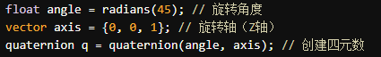
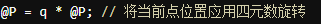
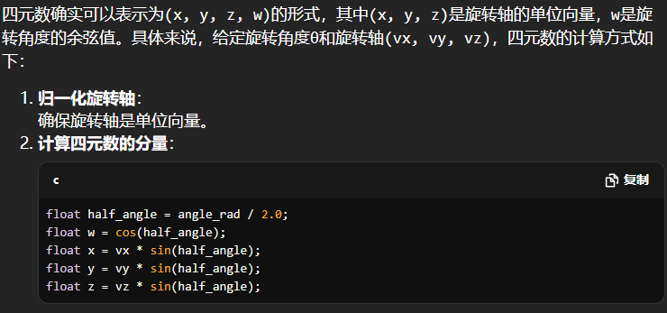
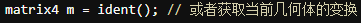
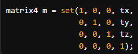
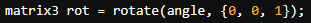
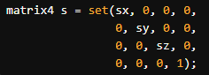
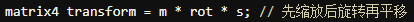
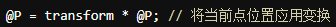

### 矩阵
- **类型**：Houdini中有2x2、3x3、4x4等不同维度的矩阵。
- **用途**：矩阵用于变换（如平移、旋转、缩放）、法线变换、物体坐标系转换等。

### 常用函数
| 函数                  | 返回值                   | 描述                          |
|-----------------------|--------------------------|-------------------------------|
| `ident()`             | `matrix`                 | 返回单位矩阵（identity matrix）|
| `translate(matrix, vector)` | `matrix`           | 返回平移后的矩阵              |
| `rotate(matrix, angle, vector)` | `matrix`       | 返回旋转后的矩阵              |
| `scale(matrix, vector)` | `matrix`               | 返回缩放后的矩阵              |
| `invert(matrix)`      | `matrix`                 | 返回矩阵的逆                  |
| `determinant(matrix)` | `float`                  | 返回矩阵的行列式              |

```c
// 创建一个3x3单位矩阵
matrix3 m = ident();

// 平移矩阵
vector t = {1, 0, 0};
m = translate(m, t);

// 旋转矩阵
float angle = radians(45);
vector axis = {0, 1, 0}; // 绕Y轴旋转
m = rotate(m, angle, axis);

// 缩放矩阵
vector s = {2, 2, 2};
m = scale(m, s);
```

这些是VEX中矩阵的基本用法和相关知识点。

| 函数                                   | 返回值                  | 描述                                     |
|----------------------------------------|-------------------------|------------------------------------------|
| `detail(geometry, attribute, index)`  | `float/int`             | 返回特定几何体的单个细节属性值             |
| `prim(geometry, attribute, primnumber)`| `float/int`             | 返回特定原始几何体的属性值                  |
| `point(geometry, attribute, pointnumber)`| `float/int`             | 返回特定点的属性值                         |
| `vertex(geometry, attribute, vertexnumber)`| `float/int`             | 返回特定顶点的属性值                       |

| 函数             | 返回值                       | 描述                          |
|------------------|------------------------------|-------------------------------|
| `primpoints(geometry, prim_index)` | 点索引数组                 | 返回指定原始上的所有点索引   |
| `primvertex(geometry, prim_index)` | `vertex_index` | 返回指定原始体的第一个顶点索引。      |
| `pointprims(geometry, point_index)` | `[prim_index]` | 返回与指定点相关联的原始体索引列表。  |
| `primintrinsic(geometry, prim_index, name)` | `value` | 获取原始体的内在属性值，例如“pointcount”。|
| `pointattrib(geometry, name)` | `value`            | 获取指定点的属性值。                   |
| `vertexattrib(geometry, name)` | `value`           | 获取指定顶点的属性值。                 |


| 函数               | 返回值            | 描述                                    |
|--------------------|-------------------|-----------------------------------------|
| `addpoint(geometry)` | `point_index`    | 在指定几何体上添加一个新点，返回新点的索引。 |
| `addvertex(geometry, primitive_index)` | `vertex_index` | 在指定原始体上添加一个新顶点，返回新顶点的索引。 |
| `addattrib(geometry, type, name)` | `attrib_index` | 在几何体上添加一个新属性，返回属性的索引。      |
| `addprimattrib(geometry, name)` | `attrib_index` | 在原始体上添加一个新属性，返回属性的索引。      |
| `addpointattrib(geometry, name)` | `attrib_index` | 在点上添加一个新属性，返回属性的索引。         |
| `addprim(geometry, type)` | primitive_index | 在指定几何体上添加一个新原始体，返回新原始体的索引。type可以是'polyline'、'polygon'等。|


| 函数            | 返回值            | 描述                                    |
|-----------------|-------------------|-----------------------------------------|
| `itoa(int)`     | `string`          | 将整数转换为字符串。                   |
| `atoi(string)`  | `int`             | 将字符串转换为整数。                   |
| `ftoa(float)`   | `string`          | 将浮点数转换为字符串。                 |
| `atof(string)`  | `float`           | 将字符串转换为浮点数。                 |
| `strstr(string, substring)` | `int` | 查找子字符串在字符串中首次出现的位置。 |

这些函数在数据处理和格式转换时非常实用。


| 函数                             | 返回值                                   | 描述                                                  |
|----------------------------------|------------------------------------------|-------------------------------------------------------|
| `getbbox(geometry)`              | `((min_x, min_y, min_z), (max_x, max_y, max_z))` | 返回给定几何体的边界框（最小和最大坐标点）。          |
| `getbbox_center(geometry)`       | `(center_x, center_y, center_z)`       | 返回给定几何体边界框的中心点坐标。                    |
| `getbbox_size(geometry)`         | `(size_x, size_y, size_z)`             | 返回给定几何体边界框的尺寸。                          |
| `getbbox_min(geometry)`          | `(min_x, min_y, min_z)`                | 返回给定几何体边界框的最小坐标点。                    |
| `getbbox_max(geometry)`          | `(max_x, max_y, max_z)`                | 返回给定几何体边界框的最大坐标点。                    |
| `getpointbbox(geometry, point_index)` | `((min_x, min_y, min_z), (max_x, max_y, max_z))` | 返回特定点的边界框（最小和最大坐标点）。              |
>使用cross()进行叉乘。
使用dot()进行点乘。
使用 * 运算符进行分量相乘。
vector a = {1, 2, 3};
vector b = {4, 5, 6};
float result = dot(a, b);

变量不需下文显式类型，属性需要


rand 和 random  `[0, 1]` 
noise和curlnoise `[-1, 1]`

```
两个相连的节点a和b
b想访问a创建的属性
需要在b中用变量采样a中属性

b节点 示例：
int shuzu[] = i[]@shuzu; // 将属性转换为变量
//这里填写shuzu的处理
i[]@shuzu = shuzu; //将变量转换为属性
```
lookat可以用来获得orient


>**[ ]作用**
数组索引：如myArray[0]访问第一个元素。
定义数组：如int myArray[] = {1, 2, 3};。


>**lookat**：生成一个视图矩阵，使得相机朝向指定目标点（lookat(cameraPos, targetPos)）。
**invert**：计算并返回给定矩阵的逆矩阵，用于反向变换（invert(matrix)）。
**gettransform**：获取指定节点变换矩阵，表示该节点的平旋缩信息（gettransform("node_path")）。
**transpose**：返回给定矩阵的转置矩阵，行列互换用于法线和其他向量的变换（transpose(matrix)）


rand() 0-1随机数，括号内为种子
与噪声函数不同，random() 不能提供值之间的平滑过渡

##### addvertex addpoint addprim的格式
* int addprim(0,"polyline",@ptnum,int) 
* int addpoint(int geometry, vector position)
* int addvertex(int geometry, int prim_num,int point_num) 本质上不是在画东西，而是将生成的点借给prim使用


>角度转弧度：使用 radians() 函数。
float radians_value = radians(degrees_value);
弧度转角度：使用 degrees() 函数。
float degrees_value = degrees(radians_value);

骰子的期望是3.5，将每个数值×各自概率

向下取整:**floor(5.7)**    返回5
取模运算:**angle % 360** 会返回在0到360度之间的角度

>**四元数实现旋转**：
>
>

orient默认是四元数
>
>次要（可不知道）
>

>**矩阵相关**
>
>先定义初始矩阵

然后矩阵实现平移：

再旋转：

再缩放：

最后：



>逻辑与：&&
逻辑或：||
逻辑非：!
等于：==
不等于：!=

>优先级顺序（高到低）：
比较运算符（<, >, <=, >=）
逻辑与（&&）
逻辑或（||）

add prim（）用法
int prim = addprim(geoself(), "poly")
1. "poly"：闭合多边形，可以使用 0 个或多个点。
2. "polyline"：开放多边形，可以使用 0 个或多个点。
3. "tet"：四面体原始体，需要正好 4 个点，无法向此原始体添加顶点。
4. "sphere", "circle", "tube", "metaball", "metasquad"：球体、圆、管、变形球或超二次体，正好需要 1 个点，


改变数值类型，防止计算精度出问题（houdini中两个整数除法结果默认整数）
1. (float)：转为浮点数。
2. (int)：转为整数。
3. (double)：转为双精度。
4. (vector)：转为向量。
5. (string)：转为字符串


将closestPt变量设置为属性观察：
setpointattrib(0, "closestPt", @ptnum, closestPt);。

*默认包含PNCDU五个属性

Vex具有感知类型特性：
pos *= float(rand(seed));均匀缩放
pos *= rand(seed);三维度不同的缩放

<div style="border: 1px solid #ccc; padding: 10px; background-color: #f9e79f;">
    <div style="white-space: pre-wrap; overflow-wrap: break-word;">
        <strong>VEX相关</strong>  <br>
        $：用于引用全局变量，如 $F 表示当前帧数。<br>
        %：用于取模运算，如 a % b 计算 a 除以 b 的余数。<br>
        *：取所有<br>
        ！：!Group:给Group顶点组取反，!仅适用布尔值整数，返回布尔值，整数是1非整数为0，不可对N P等操作<br>
    </div>
</div>

# Houdini 中的数据结构

| 数据结构 | 定义                                       | 特点                              | 示例                                      | 用途                                       |
|----------|------------------------------------------|----------------------------------|-----------------------------------------|------------------------------------------|
| 列表List    | 有序的元素集合，可以包含不同类型的元素。     | 动态大小；可以修改               | `list myList = {1, 2, 3, "string"};` | 动态存储多个元素，适用于频繁添加或删除元素。<br>例如：在粒子系统中存储活动粒子的 ID。 |
| 数组Array     | 固定大小的有序元素集合，通常包含相同类型的元素。 | 在声明时定义大小；大小不可更改   | `int myArray[3] = {1, 2, 3};`        | 存储固定数量的同类型元素，适用于几何体的属性或特征。<br>例如：在着色器中存储多个颜色值。 |
| 元组Tuple    | 固定大小的有序元素集合，可以包含不同类型的元素。 | 不可修改；通常用于传递多个值    | `vector myVector = set(1.0, 2.0, 3.0);` | 表示几何坐标、法线或颜色等多个属性的组合。<br>例如：创建一个位置向量。 |
| 字典Dictionary     | 键值对集合，通过键访问对应的值。             | 动态大小；可以包含不同类型的键和值 | `dictionary myDict = {"key1": value1, "key2": value2};` | 存储复杂数据的映射，便于快速查找和管理。<br>例如：存储材质属性或几何体名称与其对应参数的映射。 |

**push()** 给数组添加数值，例 push(myArray,135);135为数值
**pop()** 移除数组最后一个值，并返回它 例 pop(myArray,1);1为索引
**point()** point(饼属耗)
**setpointattrib(0,"myArray",0,myArray)** 饼属耗值;


