| 特性              | 动态归一化                          | Sigmoid 函数                      |
|-------------------|-----------------------------------|-----------------------------------|
| **范围控制**       | 精确映射输入范围到目标范围            | 自适应，无需知道输入范围            |
| **平滑性**         | 线性映射，过渡不平滑                 | 中心变化快，两端平缓               |
| **适用场景**       | 数据规范化、贴图 UV、颜色渐变等         | 动态效果控制、权重分配、光照衰减等    |
| **实现复杂度**     | output = Input-Min/Max-Min                 | output = 1/1+e^-x             |

### 麦克斯韦方程组

##### 电场与电荷密度的关系：  
   \[
   \nabla \cdot \mathbf{E} = \frac{\rho}{\varepsilon_0}
   \]  
   - \(\nabla \cdot \mathbf{E}\)：电场 \(\mathbf{E}\)（向量电场）的**散度**，表示电场在某点的发散程度。  
   - \(\rho\)：电荷密度，表示单位体积内的电荷量。  
   - \(\varepsilon_0\)：真空介电常数，表示真空中电场与电荷的关系。  

##### 磁感应强度无散度：  
   \[
   \nabla \cdot \mathbf{B} = 0
   \]  
   - \(\nabla \cdot \mathbf{B}\)：磁场 \(\mathbf{B}\)（向量磁感应强度）的**散度**，表示磁场在某点的发散程度。  
   - 0：表示磁场没有源或汇，即磁场的磁力线是闭合的。  

##### 法拉第感应定律：  
   \[
   \nabla \times \mathbf{E} = -\frac{\partial \mathbf{B}}{\partial t}
   \]  
   - \(\nabla \times \mathbf{E}\)：电场 \(\mathbf{E}\) 的**旋度**，表示电场在某点的环绕程度。  
   - \(-\frac{\partial \mathbf{B}}{\partial t}\)：磁场 \(\mathbf{B}\) 随时间 \(t\) 的变化率，表示磁场变化产生的感应电场。  
   - ∂ 表示偏导数,多变量选一个,d针对单一变量

##### 安培-麦克斯韦定律：  
   \[
   \nabla \times \mathbf{B} = \mu_0 \mathbf{J} + \mu_0 \varepsilon_0 \frac{\partial \mathbf{E}}{\partial t}
   \]  
   - \(\nabla \times \mathbf{B}\)：磁场 \(\mathbf{B}\) 的**旋度**，表示磁场在某点的环绕程度。  
   - \(\mu_0\)：真空磁导率，表示真空中磁场与电流的关系。  
   - \(\mathbf{J}\)：电流密度，表示单位面积上的电流量。  
   - \(\varepsilon_0\)：真空介电常数，同上。  
   - \(\frac{\partial \mathbf{E}}{\partial t}\)：电场 \(\mathbf{E}\) 随时间 \(t\) 的变化率，表示变化的电场产生的磁场。

---

### 三角符号（\(\nabla\)）的含义
\(\nabla\) 是一个通用的微分算子，称为“梯度算子”或“Nabla算子”。可以表示梯度、散度和旋度，本质上是对场的方向导数操作具体：

- **散度**：\(\nabla \cdot\) 结合点乘操作，计算的是一个标量（“流出/流入”）。  
- **旋度**：\(\nabla \times\) 结合叉乘操作，计算的是一个向量（“旋转”方向）。  

### 1. **梯度**（Gradient）  
\[
\nabla f = \left( \frac{\partial f}{\partial x}, \frac{\partial f}{\partial y}, \frac{\partial f}{\partial z} \right)
\]  
- 适用于标量场 \(f(x, y, z)\)。
- **含义**：表示标量场在空间中变化最快的方向及变化率。  
- **结果**：梯度的结果是一个**向量**。  

### 2. **散度**（Divergence）  
\[
\nabla \cdot \mathbf{F} = \frac{\partial F_x}{\partial x} + \frac{\partial F_y}{\partial y} + \frac{\partial F_z}{\partial z}
\]  
- 适用于向量场 \(\mathbf{F} = (F_x, F_y, F_z)\)。  
- **含义**：散度表示向量场在某点的“流出”或“流入”程度，正值表示“发散”（源），负值表示“汇聚”（汇）。  
- **结果**：散度的结果是一个**标量**。

### 3. **旋度**（Curl）  
\[
\nabla \times \mathbf{F} = \left( 
\frac{\partial F_z}{\partial y} - \frac{\partial F_y}{\partial z}, 
\frac{\partial F_x}{\partial z} - \frac{\partial F_z}{\partial x}, 
\frac{\partial F_y}{\partial x} - \frac{\partial F_x}{\partial y}
\right)
\]  
- 适用于向量场 \(\mathbf{F} = (F_x, F_y, F_z)\)。  
- **含义**：旋度表示向量场在某点的“旋转”程度及方向。  
- **结果**：旋度的结果是一个**向量**。

---

## 矩阵与向量乘法
- 矩阵在前，向量在后：`Mv` 等价于 `vM^T`  
  （`M^T` 是矩阵 `M` 的转置,v一般竖着写)

### 正交矩阵
对于方阵，正交矩阵转置等于它的逆矩阵：`M^T = M^-1`

### 逆矩阵（通用）
- 定义：`M * M^-1 = I`  
- 适用：任意可逆矩阵

### 线性变换
- 满足：
  1. **加法保持性**：`T(u + v) = T(u) + T(v)`
  2. **数乘保持性**：`T(c * v) = c * T(v)`
- 特性：
  - 结构不改变直线性
  - 原点不动
- 例子：旋转、缩放、剪切

### 非线性变换
- 不满足线性变换的性质
- 例子：平移
- 故引入齐次坐标 **齐次坐标本质上是坐标系的升维切片**

---

## 线性变换的几何特性
- 保持直线性
- 原点保持不动

>使用微积分推导圆面积公式
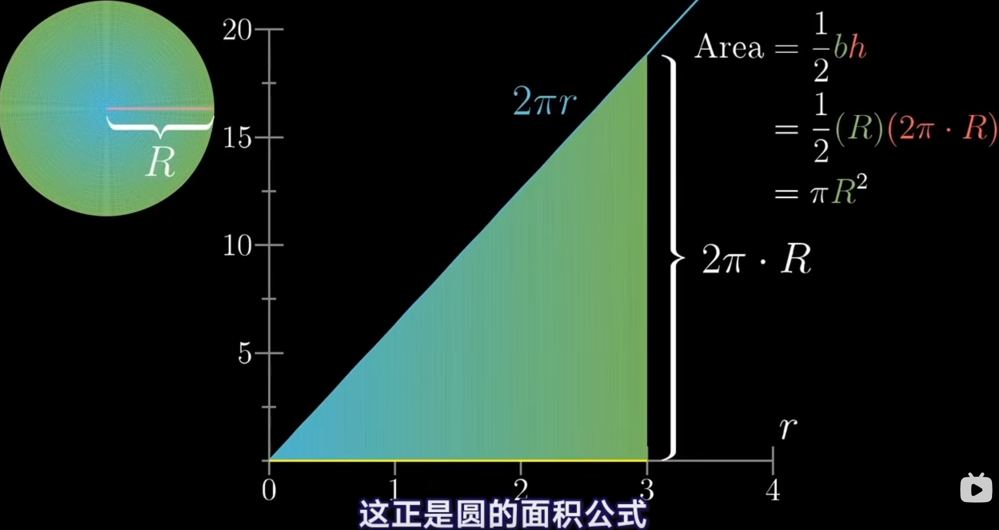
本质上将复杂问题转换为 **寻找积分函数A(x)面积问题**
##### 启发:不要硬算,升维寻找捷径更加高效,过于复杂往往意味着错误

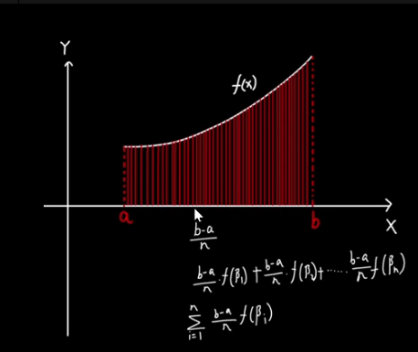

>#### 齐次坐标
假设一个二维向量(x,y)
实现斜切:
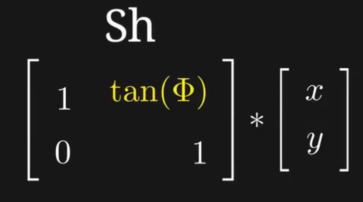
实现旋转:
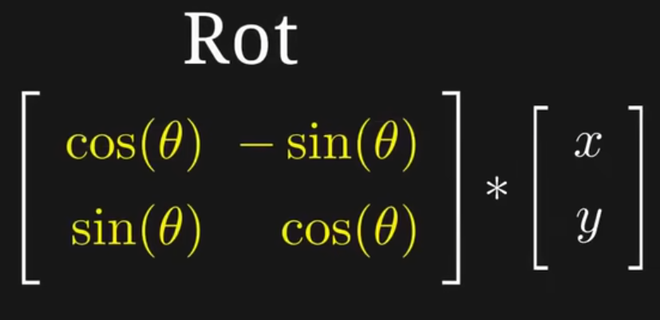
综合应用:
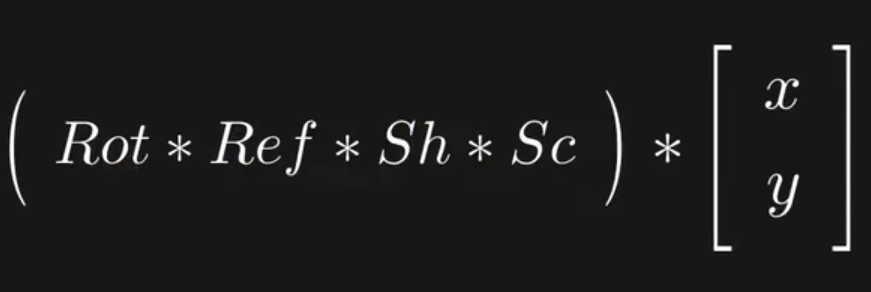
但无法实现平移,所以引入第三个分量(x,y,1),即齐次坐标,方便计算机高效处理多个点的操作
如果是(x,y,0)则是固定缩放,常被应用在**光和法线**上
如果是(x,y,1)则可将移动也可以用矩阵相乘来实现,来**高效一致**的处理所有变换
如果是(x,y,w)则得到(x/w,y/w,1),常被应用在**透视投影**
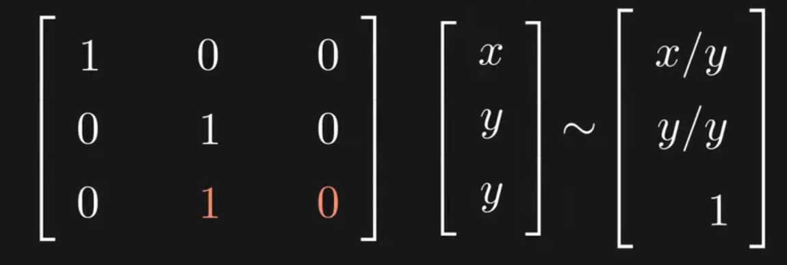

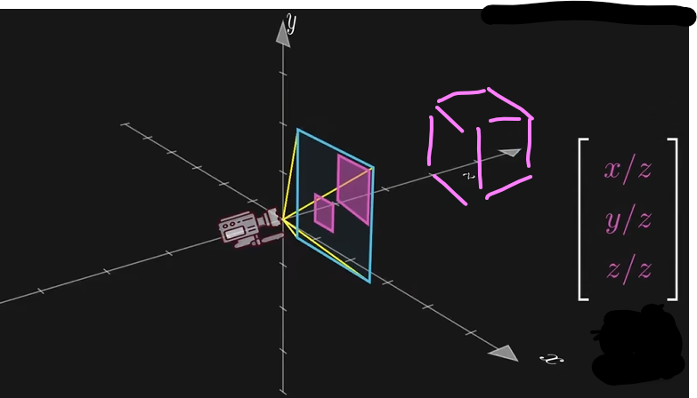

>#### 最大化对数似然和最小化损失函数的区别
| 特征                | 最大化对数似然                                         | 最小化损失函数                                       |
|---------------------|-------------------------------------------------------|-----------------------------------------------------|
| **定义**            | 使得观察到的数据生成概率最大化                       | 减少模型预测与真实值之间的误差                     |
| **目标**            | 优化数据生成的概率分布                               | 提高模型的预测准确性                                 |
| **应用背景**        | 统计学，生成模型                                     | 机器学习，监督学习                                   |
| **参数调整**        | 通过计算对数似然调整权重和偏置                       | 通过计算损失函数调整权重和偏置                       |
| **公式**            | \[ \max_{\theta} \log P(X / \theta) \]              | \[ \min_{\theta} L(y, \hat{y}) \]                   |
| **示例**            | 训练生成模型如扩散模型                               | 训练分类器或回归模型                                 |
| **训练步骤**        | 1. 初始化模型参数 2. 计算对数似然 3. 更新参数 4. 重复直到收敛 | 1. 初始化模型参数 2. 计算损失 3. 更新参数 4. 重复直到收敛 |

>#### 模型参数
>通常指的是**模型权重（Weights）/ 偏置（Biases）**,数值类型为浮点数

>#### 最大化数据对数似然
>

通过最大化对数似然，模型参数能够被调整，使得模型生成的数据与观察到的数据更一致

>#### 概率密度函数
>N() 符号通常表示高斯分布（或正态分布）的**概率密度函数**
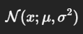
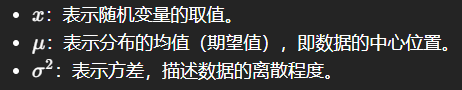
方差越大 钟形越扁
以正态分布为例，其概率密度函数的公式为：
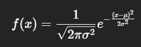

伪造身份
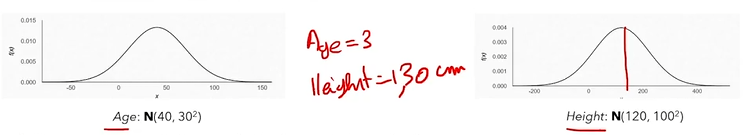
显然不合理,所以需要联合分布Joint Distribution
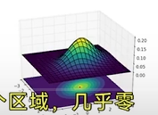

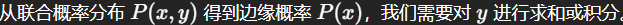
对y积分,即消去y的影响

| 混合模式名称                | 数学原理                                       | 效果简要说明                   |
|----------------------------|---------------------------------------------|----------------------------|
| Normal（正常）             | result = up                                | 直接显示上层颜色。              |
| Additive（叠加）           | result = up + down                        | 颜色相加，通常用于光亮效果。      |
| Subtract（减去）           | result = down - up                        | 颜色相减，产生阴影效果。          |
| Multiply（正片叠底）       | result = up × down                        | 颜色相乘，通常用于加深效果。      |
| Screen（滤色）             | result = 1 - (1 - up) × (1 - down)      | 反转相乘，产生减淡效果。          |
| Color Burn（颜色加深）     | result = down / (1 - up)                 | 增加底层颜色的对比度。            |
| Color Dodge（颜色减淡）    | result = down / (1 - up)                 | 增加底层颜色的亮度。              |
| Overlay（叠加）            | result = (up < 0.5) ? (2 × up × down) : (1 - 2 × (1 - up) × (1 - down)) | 结合乘法和滤色效果，增加对比度。|
| Darken（变暗）             | result = min(up, down)                   | 取较暗的颜色，产生阴影效果。      |
| Lighten（变亮）            | result = max(up, down)                   | 取较亮的颜色，产生高光效果。      |
| Difference（差异）         | result = |up - down|                     | 颜色差异，产生对比效果。          |
| Exclusion（排除）          | result = up + down - 2 × up × down       | 颜色排除，产生柔和的对比效果。     |
| Linear Light（线性光）     | result = up + down - 0.5                  | 结合加法和减法，增加亮度和对比度。 |

多变量函数表示为曲面
| 特性         | 导数                            | 偏导数                          |
|--------------|---------------------------------|---------------------------------|
| 定义         | 单变量函数的变化率             | 多变量函数中某一变量的变化率   |
| 表示         | \( f'(x) \)                     | \( \frac{\partial f}{\partial x} \) |
| 自变量数量   | 1                               | 多于1                           |
| 计算方式     | \( \lim_{\Delta x \to 0} \)    | \( \lim_{\Delta x/y/z \to 0} \)    |
| 几何意义     | 切线斜率                       | 在特定方向上的切线斜率        |

>#### 梯度(vector)
>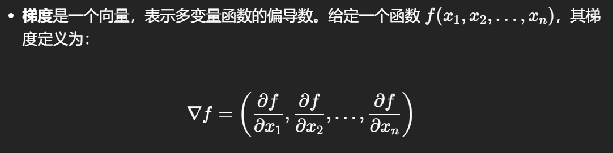
梯度指向函数上升最快的方向,大小为速率,常用于**损失函数**的优化
>##### 损失函数的优化：
>在训练模型时，目标是最小化损失函数 L(θ)。我们需要计算损失函数相对于模型参数 θ 的梯度 ∇()
∇L(θ)，然后使用梯度下降法更新参数
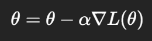
*α 是学习率*

| 损失函数类型         | 公式                                   | 应用场景               |
|----------------------|----------------------------------------|------------------------|
| 均方误差（MSE）      | \( L(y, \hat{y}) = \frac{1}{n} \sum_{i=1}^{n} (y_i - \hat{y}_i)^2 \) | 回归问题               |
| 平均绝对误差（MAE）  | \( L(y, \hat{y}) = \frac{1}{n} \sum_{i=1}^{n} (y_i - \hat{y}_i) \)   | 回归问题               |
| 交叉熵损失（Binary Cross-Entropy） | \( L(y, \hat{y}) = -\left( y \log(\hat{y}) + (1 - y) \log(1 - \hat{y}) \right) \) | 二分类问题             |
| 交叉熵损失（Categorical Cross-Entropy） | \( L(y, \hat{y}) = -\sum_{i=1}^{C} y_i \log(\hat{y}_i) \) | 多分类问题             |
| Hinge损失            | \( L(y, \hat{y}) = \max(0, 1 - y\hat{y}) \) | 支持向量机（SVM）      |
| Kullback-Leibler散度（KL散度） | \( D_{KL}(P  ll  Q) = \sum_{i} P(i) \log\left(\frac{P(i)}{Q(i)}\right) \) | 分布预测               |
| 对比损失（Contrastive Loss） | \( L(y, \hat{y}) = y \cdot \frac{1}{2} \| \mathbf{f}_1 - \mathbf{f}_2 \|^2 + (1 - y) \cdot \frac{1}{2} \max(0, m - \| \mathbf{f}_1 - \mathbf{f}_2 \|)^2 \) | 任务如人脸验证        |
| 负对数似然损失（Negative Log-Likelihood） | \( L(y, \hat{y}) = -\log(P(y|\hat{y})) \) | 概率模型               |

>#### 特征值和特征向量
>**特征向量（Eigenvector）**：对于给定的方阵 A，如果存在非零向量 v 和标量 λ，使得以下等式成立：

则称 v 为矩阵 A 的特征向量，λ 为对应的特征值。(个人理解:将矩阵降维成标量和向量)
特征值（Eigenvalue）：是与特征向量相关联的标量，表示特征向量在变换下的伸缩因子。

>#### 布朗运动
>是微小粒子或者颗粒在流体中做的无规则运动。一种正态分布的独立增量连续随机过程。
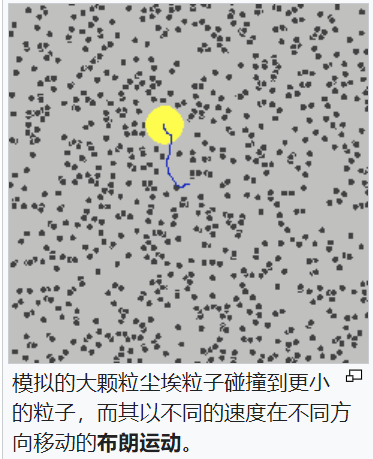

>##### 扩散过程原理
>随机微分方程 SDE

>##### 反向过程原理
>常微分方程
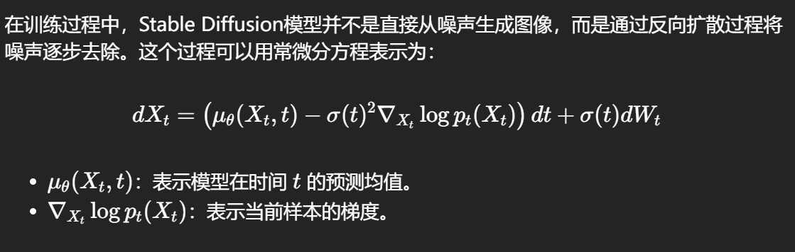
>##### 训练目标原理
>损失函数
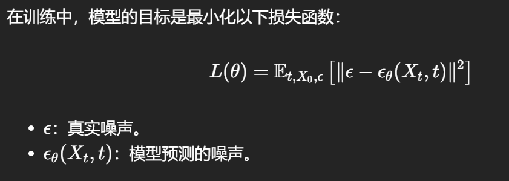

>贝叶斯定理
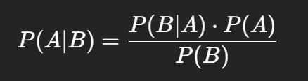
>1. **\( P(A|B) \)**：在测试结果为阳性的情况下，某人患有疾病的概率。（后验概率）。
>2. **\( P(B|A) \)**：在某人确实患有疾病的情况下，测试结果为阳性的概率。（似然性）。
>3. **\( P(A) \)**：某人患有该疾病的总体概率。先验概率。
>4. **\( P(B) \)**：测试结果为阳性的总体概率。（边际概率）。

>##### 边缘化Marginalize
>对不感兴趣的变量进行积分（在连续情况下）或求和（在离散情况下），得到感兴趣变量的边际分布

>##### KL散度
>

>**正态分布**：\( N(\mu, \sigma^2) \)
    - \( \mu \)：均值，决定分布的中心位置。
    - \( \sigma^2 \)：方差，决定分布的宽度（数据的分散程度）。
**特征**：图形呈钟形，对称。

>**标准正态分布**：\( N(0, 1) \)
    - 均值 \( \mu = 0 \)
    - 方差 \( \sigma^2 = 1 \)
**特征**：图形在0处对称，标准差为1。

>似然：特定选择下的观察结果（例如顾客选择拿铁的情况）。
边际似然：所有选择下的总体概率（所有咖啡类型的受欢迎程度）

| 序号 | 概念               | 公式                                                                                   | 用途                                                         |
|------|--------------------|----------------------------------------------------------------------------------------|--------------------------------------------------------------|
| 1    | 随机过程           | \( B(t) \sim \mathcal{N}(0, t) \)                                                    | 模拟数据的随机扰动，生成具有自然随机性的样本。             |
| 2    | 概率分布           | \( f(x; \mu, \sigma^2) = \frac{1}{\sqrt{2\pi \sigma^2}} e^{-\frac{(x - \mu)^2}{2\sigma^2}} \) | 建模生成样本中的噪声，常通过正态分布添加噪声。             |
| 3    | 最大似然估计     |                            | 最大化对数似然函数，以估计模型参数，优化模型生成能力。   |
| 4    | 变分推断           |       | 近似复杂后验分布，简化推断过程，提升训练效率。             |
| 5    | 信息论             |                        | 衡量模型生成分布与真实分布之间的差异，优化模型设置。     |
| 6    | 随机微分方程       | \( dX_t = \mu(X_t, t) dt + \sigma(X_t, t) dB_t \)                                   | 描述数据生成过程中的动态变化，帮助理解训练过程。         |
| 7    | 采样方法           |                                            | 从复杂分布中进行采样，生成模型在训练期间获取样本。       |
| 8    | 优化算法           | \( \theta^{(t+1)} = \theta^{(t)} - \eta \nabla_{\theta} J(\theta^{(t)}) \)         | 优化模型参数以最小化损失函数，确保生成结果与真实数据接近。 |
| 9    | 二项分布           |         | n 次独立试验中，成功次数 k 的概率，给定成功概率 p |

1. 世界坐标：描述物体在三维空间中的绝对位置。
2. 视图坐标：相对于相机位置的三维坐标。
3. 屏幕坐标：二维像素坐标，表示在显示器上的位置。（左上角为原点，像素值）
4. NDC坐标：标准化设备坐标，范围为 [-1, 1]，用于统一表示在设备上的位置。（标准化，屏幕中心为原点）

5. 逆矩阵：一个矩阵的反，AB=I，则A为B的逆矩阵（倒数）。逆矩阵常用于视图转换
6. 转置矩阵：行列互换，A的转置为AT，常用于法线变换
7. 齐次坐标：通过增加一个额外的维度来表示点或向量，使得平旋缩可以统一使用矩阵乘法处理。

欧拉旋转的数值是相对初始的物体坐标系的，和视图中的实时更新的物体局部坐标系不同

[图片]

MathBasic
1. 世界坐标：描述物体在三维空间中的绝对位置。
2. 视图坐标：相对于相机位置的三维坐标。
3. 屏幕坐标：二维像素坐标，表示在显示器上的位置。（左上角为原点，像素值）
4. NDC坐标：标准化设备坐标，范围为 [-1, 1]，用于统一表示在设备上的位置。（标准化，屏幕中心为原点）

5. 逆矩阵：一个矩阵的反，AB=I，则A为B的逆矩阵（倒数）。逆矩阵常用于视图转换
6. 转置矩阵：行列互换，A的转置为AT，常用于法线变换
7. 齐次坐标：通过增加一个额外的维度来表示点或向量，使得平旋缩可以统一使用矩阵乘法处理。

欧拉旋转的数值是相对初始的物体坐标系的，和视图中的实时更新的物体局部坐标系不同

#### 向量点乘叉乘
##### 点乘原理

##### 点乘用途

##### 叉乘原理

##### 叉乘用途

