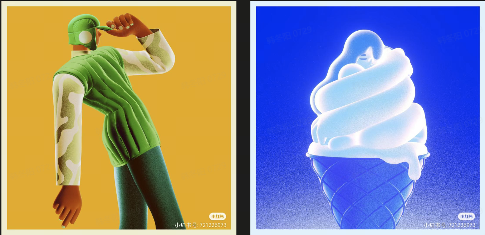

| 目前水准| 现在 | 目标|要求|
|-----|-----|---|---|
| Houdini | 40 | 70（骨架提升） | 熟练节点特效，程序化建模、toblender流程，熟悉vex |
| UE5 | 20 | 50| 熟练场景搭建,熟练shader编写 |
| Comfyui | 70 | 80（熟练度 |  |

| 目前水准| 现在 | 目标|要求|
|-----|-----|---|---|
| Blender | 70 | 80（熟练度 | 精通几何节点 材质节点 |
| Houdini | 30 | 70（骨架提升） | 熟练节点特效，程序化建模、toblender流程，熟悉vex |
| Comfyui | 70 | 80（熟练度 |  |
| Pytorch | 30 | 50| 保持跟进 |
| UE5 | 10 | 20|  |

特效，程序化建模，程序化shader是你目前和TA交叉区域，而且你擅长，完美

拉开对比，尤其是材质对比，色彩对比，甚至是风格对比，大道至简

世界观明显，类似你的画风或者大声说爱你这种

把Ai当成纹理，置换来用，也包括背景

当你想装逼的时候，集中在技术（项目的复数）上，而非项目上

不好做出细节的用风格化材质，类似这样

1.中高复杂度的作品复杂度
2.高效率，低难度的项目操作
3.高难度高复杂度的技术思路与积累

1.多用几何节点，程序化
2.多用纹理绘制
3.多用圆润表达
4.改进已有的创意

每个项目都找到一个可以做的很细腻精彩的材质，如刺绣

一张图两个重点，其中一个动效 另一个建模 其他都是找模型或者ai来做

所以未来想做好东西就是通过自己的能力结合起来
插画能力解决~构图，解决纹理绘制，构建风格这些
逻辑3d能力解决~材质，定制化的参数纹理，通过几何节点构建的定制化模型等等

除了色相跳动，概念上也要跳动，这样更好更立体，脑内风格渲染很重要

3d内容很多且复杂，那么寻找准自己的角度，不断深挖，与插画不同,3d上限更高

像beeple一样 大的不一定是人，可以是emoji或者小物件