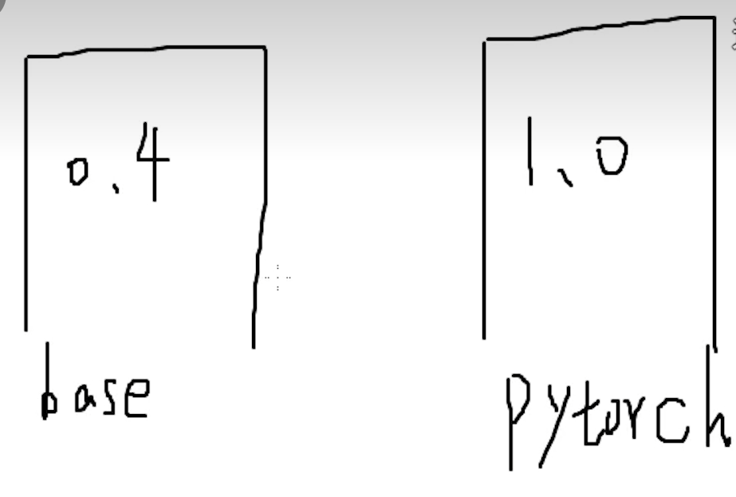

|  类型        |  描述                   |
|-------------|------------------------|
|  ML（机器学习）分为以下三种 |  =  DL（深度学习）     |
|  CNN（卷积神经网络） |  主要处理图像        |
|  RNN（循环神经网络） |  主要处理文本        |
|  GAN（对抗神经网络） |  生成图片            |
|  Auto-Encoder（自编码器） |  生成            |
|  Transformer() |  chatgpt            |
| 原理示意| |
|  此图对应上图 一个小圆 |  |

anaconda就是管理环境的工具


conda和pip是并列概念 都是包的安装工具

>**梯度下降**是优化模型的核心算法，通过不断更新参数来最小化损失函数。
**收敛**是判断算法是否达到最佳状态的标准，确保训练过程的有效性。
**正态分布**在初始化、引入随机性和假设检验等方面发挥着重要作用，帮助模型更好地学习和泛化。


魔术方法===私有属性
示例-add- 来赋予Menu可加性👇
```
class Menu:
    def __init__(self, items):
        self.items = items

    def __add__(self, other):
        return Menu(self.items + other.items)

menu1 = Menu(["披萨"])
menu2 = Menu(["意大利面"])
combined_menu = menu1 + menu2
print(combined_menu.items)  # 输出: ['披萨', '意大利面']
```
```
class Restaurant:
    def __init__(self, name):
        self.name = name

    def __str__(self):
        return f"Restaurant: {self.name}"

# 示例
rest = Restaurant("美味餐厅")
print(rest)  # 输出: Restaurant: 美味餐厅
```

>这里的__len__相当于给Menu赋予了长度属性 从而len可以识别其长度,👇
```
class Menu:
    def __init__(self, items):
        self.items = items

    def __len__(self):   
        return len(self.items)

# 示例
menu = Menu(["披萨", "意大利面", "沙拉"])
print(len(menu))  # 输出: 3
```

print()会自动调用--str--属性

>类 餐馆模板
对象 麦当劳连锁店
实例 海淀麦当劳1号店


>pip：Python 的包管理工具
conda: 包管理工具 但不限于python

>
*不同的pytorch版本*

类是对象的蓝图，对象是类的实例
python面向对象编程，具有封装，继承，多态等特性，继承就是儿子获得爸爸属性，多态就是不同的人(对象)可以同一个妓女(方法，接口)
vex面向过程
AI相关
高精需求
- 生成贴图
- 生成背景和其他物件（喂精致的
- 先做精致然后扩图
vae编码~行李打包
vae解码~行李拆包
可以用大模型（搬家公司）的vae袋子也可以用自己找的vae
图像可以通过vae编码为latent潜在空间（行李空间）
采样器的降噪就是重绘幅度

latent直接缩放等同于ps放大图片，需要再采样重绘一次


```Python
# 定义class可以理解为在定义班长self，然后与班长对接，用.链接不同同学
class Engine:
    def __init__(self, horsepower):
        self.horsepower = horsepower

class Car:
    def __init__(self, brand, engine):
        self.brand = brand
        self.engine = engine

# 创建Engine实例和Car实例
my_engine = Engine(250)
my_car = Car("Toyota", my_engine)

# 使用点号进行链式访问
print(my_car.engine.horsepower)  # 输出: 250
```

API python用法
1.在json和py存放目录输入powershell启动powershell 2.启动python 3.操作具体的那个py
注意：json是接口文件，py才是脚本文件