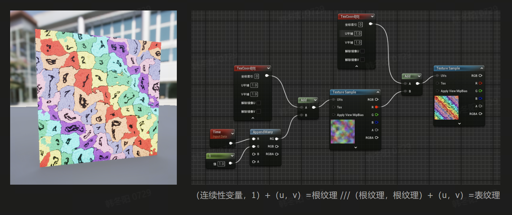

>Tags{"LightMode"="ForwardBase"}
>确认主光源 防止混乱


| **内置变量**                                                                 | **数据类型** | **注释**         |
|-------------------------------------------------------------------------------|--------------|------------------|
| _WorldSpaceLightPos0（光源位置0）, _WorldSpaceLightPos1（光源位置1）          | `float4`     | 光源位置         |
| _LightColor0（光源颜色0）, _LightColor1（光源颜色1）                          | `float4`     | 光源颜色         |
| _LightIntensity0（光源强度0）, _LightIntensity1（光源强度1）                  | `float`      | 光源强度         |
| _ShadowMatrix0（阴影矩阵0）, _ShadowMatrix1（阴影矩阵1）                      | `float4x4`   | 阴影矩阵         |
| _CameraDepthTexture（深度纹理）                                              | `Texture2D`  | 深度纹理         |
| _ProjectionParams（投影参数）                                                | `float4`     | 投影参数         |
| _CameraMain（主相机）                                                        | `Camera`     | 主相机           |
| _Object2World（物体到世界矩阵）, _World2Object（世界到物体矩阵）              | `float4x4`   | 物体变换矩阵     |
| _Time（时间）, _TimeParams（时间参数）, _SinTime（正弦时间）                  | `float4`     | 时间信息         |
| _ViewMatrix（视图矩阵）, _ProjectionMatrix（投影矩阵）                        | `float4x4`   | 视图矩阵         |
| _Color（颜色）, _SpecColor（高光颜色）, _MainTex（主纹理）                    | `float4`, `Texture2D` | 材质与颜色       |
| _BumpMap（法线贴图）                                                         | `Texture2D`  | 法线贴图         |
| _EmissionColor（发光颜色）                                                   | `float4`     | 发光颜色         |
| _AmbientSkyColor（天光颜色）, _AmbientEquatorColor（赤道光颜色）, _AmbientGroundColor（地面光颜色） | `float4`     | 环境光颜色       |
| _ScreenParams（屏幕参数）                                                    | `float4`     | 屏幕参数         |
| _DepthTexture（深度纹理）                                                    | `Texture2D`  | 深度纹理         |

这样每个变量后边都有了对应的中文翻译，方便理解。

---


>
次表面散射考虑了折射光
光线 = 折射(lambert) + 反射 + 散射
金属材质所有的折射光线都会被吸收 而非散开 
所以金属只镜面反射颜色 无漫射颜色
菲涅尔描述 被反射光线(对比被折射光线)的占比
>反射一般和折射互斥,故有
>```
>float kS = calculateSpecularComponent(...); // 反射/镜面 部分
>float kD = 1.0 - ks;                        // 折射/漫反射 部分
>```
所以先计算反射部分的方程如下:


>**PBR核心:Cook-Torrance BRDF**
*f_r镜反射强度 = (F * D * G) / (4 * (N·L) * (N·V))*
>PBR公式:
>
**F** 是菲涅尔项，金属度；
**D** 是微面分布函数，镜面反射；
**G** 是几何遮蔽因子，粗糙度；
**GI**  间镜 + 间漫
**PBR结果** 漫 + 镜 + 遮蔽
**f_r**：镜面反射强度 计算 直镜 + 间镜


*半球积分（ ），表示的是多光源下光照的叠加,只考虑单个不衰减的直线光照可以去掉*

>**\( L_o(p, w_o) \)**：出射辐射亮度  
**\( \Omega \)**：积分域（光源方向）  
**\( k_d \)**：漫反射系数  
**\( k_s \)**：镜面反射系数  
**\( c \)**：常数（光强度）  
**\( DGF \)**：光分布函数  
**\( L_i(p, w_i) \)**：入射辐射亮度  
**\( n \)**：表面法向量  
**\( w_o \cdot n \)**：出射光与法线夹角  
**\( w_i \cdot n \)**：入射光与法线夹角

---

| 名称          | 抽象化的原理（伪代码） | 说明 |
|--------------|------------------|-------------------------------|
| **Lambert** | `diffuse = surfaceColor * lightColor * max(dot(normal, lightDir), 0)` |   直漫 **法线N * 光照方向L**， |
| **Phong** | `reflectDir = reflect(-lightDir, normal)`<br>`specular = lightColor * pow(max(dot(viewDir, reflectDir), 0), shininess)` | 直镜 **反射方向R(来源于直接光L和Normal) * 观察方向V的夹角**  |
| **Blinn-Phong** | `halfwayDir = normalize(lightDir + viewDir)`<br>`specular = lightColor * pow(max(dot(normal, halfwayDir), 0), shininess)` | 直镜 **Halfway Vector（中间向量）** 替代反射向量，计算更快且更真实，**法线N dot 中间向量H**。 |
| **SH（球谐光照）** | `indirectDiffuse = dot(SH_Coefficients, normal)` | 环境和间漫 由 **球谐系数SH dot 法线向量N**  |
| **IBL（基于图像的光照）** | `reflectionVec = reflect(viewDir, normal)`<br>`indirectSpecular = sampleCubemap(envMap, reflectionVec)` | 间漫和间镜  **以反射向量R(来源于View和Normal)采样HDR环境贴图** |
| **AO（环境光遮蔽）** | `occlusion = sample(AO_Texture, UV)`<br>`ambientLight *= occlusion` | 计算 **表面对环境光的遮挡程度**，使遮挡区域变暗，提高真实感，适用于 **环境光遮蔽**。 |


unity中**Directionlight**的xyz信息是表示方向的
光源类型区别在于light_dir
>
>shader内模拟点光

切线空间坐标系中的法线是包含在网格数据中 切线：uv中u的走向引擎产生


```
// 法线贴图（像素级法线）强度思路：
1.使用顶点数据中的切线和法线构建正交基
2.像素级法线xy 分别✖️ 片元级法线的xy，
3.将其作为法线与光照点乘生成光照模型

                float3 normal = normalize(i.normal); // z
                float3 tangent = normalize(i.tangent); // x
                float3 bitangent = normalize(i.bitangent); // y
                float3 normal_dir = normalize(tangent * normal_data.x + bitangent * normal_data.y + normal * normal_data.z);

                为了将法线从切线空间转换到世界空间，需要使用切线、双切线和法线三个向量。这三个向量构成了一个正交基，可以用来将切线空间的法线向量转换到世界空间。

```


法线贴图是像素级法线


| 渲染路径         | LightMode Tag     | 描述                                   |
|------------------|-------------------|---------------------------------------|
| **前向渲染**     | `ForwardBase`     | 渲染基础光照（主光源 + 环境光）。      |
|                  | `ForwardAdd`      | 累加逐像素光照（点光源/聚光灯）。      |
|                  | `ShadowCaster`    | 生成阴影贴图（通用）。                 |
| **延迟渲染**     | `Deferred`        | 几何阶段，将材质属性输出到 GBuffer。   |
|                  | `DepthNormals`    | 生成深度 + 法线贴图，用于后处理。       |


---

>##### RenderQueue
>Background： 1000
>Geometry： 2000
>AlphaTest： 2450
>Transparent： 3000
>Overlay： 4000
>Renderqueue感觉可以理解为优先级更高的depth
stencil test 的值不是展示的颜色值 而是比较值
>Renderqueue > 模版测试优先级priority > 比深度测试高

>##### 大体思路：
>- 先用Renderqueue理清大组先后顺序
>- 再选定一个模版测试标杆如镜子，供后续比较使用
>- 最后深度测试调节每个小组内的前后

---


>视差映射:https://segmentfault.com/a/1190000003920502
>视差映射目的，精确的计算viewdir和高度图定义出来的表面的交点。
>
>视差映射的计算是在切空间进行的（跟法线映射一样）,所以lightdir和viewdir应该先转换为切空间

<!-- region iframe -->
<iframe frameborder="0" style="width:100%;height:222px;" src="https://viewer.diagrams.net/?tags=%7B%7D&highlight=0000ff&edit=_blank&layers=1&nav=1&title=#R5VhLk%2BI2EP41Oi5lW35IRxvM5rCp2qo5JDl6sQDXCMQaMUB%2Bfbpl%2BW1mSeJUZWrnMEitbknd39dqyYQuD7fPZXba%2F6pyIYnn5DdCV8TzXMcJ4Qcl90rCGK0Eu7LIrVIreCn%2BFLWllV6KXJx7ilopqYtTX7hRx6PY6J4sK0t17attleyvesp2YiR42WRyLP2tyPXeehE4rfwXUez29crgcTVyyGplKzjvs1xdOyKaErosldJV63BbConBq%2BNS2a0fjDYbK8VRP2PgVwZvmbxY3%2By%2B9L12VuTgu%2B0e1RF%2Bkr0%2BSOi50BwvaPdwVpdyY6ewk%2Bqs3AmrZQHHyTtmdpOfhToIXd5BoRQy08VbP%2FCZxW%2FX6LUuQsN6Oe2x94THUgKT0NHrvtDi5ZQZR65A5iedfxOlFrd3HbOjHrNMsKngejY3ri2xPCeqZPsOqbj%2F72PhBn8T7a06apuOHLrgdnn%2FHTpO3fkDO4ug7q5u3cHV3faeIg0dk8YN52aNNf2qCthJAwrlXg8Uv07XeopqU9ZqEO9mG09BQP9fdAzCAR2pO6KjG%2FAxHZnzOMhP09EdByNlJI4IC0kakCQicUrSiPDENEISO4RFhMYoTDySmNHYNaMM%2F0M7NVY8eivENS9KnAjgZUuSchInhDMzdUxiswZMjbMExgbm9UnCCeNm1Zgw38wLCzA05ysSe0YHzH3UYR7qDxGE4Os%2BVGddqlexVFKVbaJtCykHokwWuyN0NwCpAHmCUBZQiWI7cCjyXD7iRqkux1zkNuvOr0Jv9rbTyWR3Ju5QZ8CdYHyUuQFdBGP20DnYM3Wyh1JbZ811oIotiL9fsMKC19R1v222TlfUQa4W4gSfziZcMSi49HQzqq1RuDO%2FQBzGkJPIOo68QJoAOf16L%2BBGtZ2ORUhYgMRK1si%2FimFAUG%2FZIWtIEkp4YJgeoyZIgLuQAUhfx1ATiAiLOzYzkuijEZHOdIjRoEfE5nDqErGWzU7D8Yk%2BPHkkrmgEHmIPsi5tLLpj%2FnwsLOcqSBFdRH04XX%2FiXPEmrkizwDlxQ67Qiqui4JtaMK5Sw%2FJjrAy6mLghpqwFu5rHseZQU7jT1LbL28%2BK%2B%2FAiEk6AHvoNN2bHPZzxYvYoWHyeWLFh4fUmLm00XHgTseJzxCp6IkeAyRM5YQ69uDrlGJ5ymEArkri4OOqvSVLVyDUmDV7ZPMKXxpDjlS81VpVhdXebNhyVz58zrZjjL8L%2B48YNJtjynx2n7Mdpdd5nJ2xuLqW8J2W2ecX3349yrI0j9mT2Tciv6lzoQiEEUmx1B5kvg%2BEGoRrLsnL7MZTvpXSpdGYn%2FsTffe8%2BD1zo9otgMMLMm7jQBMOH6z%2F6YuJMpDfHPE7C9s2Deb4yl88mNSEjOVbHD5Zqge0vm%2BcCvGxStp4JyYDThRPy9q%2BHKx8nI2MLOk86Qrf9tFh9rGg%2F0NL0Lw%3D%3D"></iframe>

<!-- endregion -->


| **名称** | **保留信息** |
|----------|--------------|
| **MDD**  | - 逐帧的顶点位置（`x, y, z` 坐标）<br>- 动画帧数和时间信息（帧间隔或时间戳）<br>- 不包含拓扑结构（需要结合静态网格文件） |
| **ABC** *(Alembic)* | - 动态拓扑（每帧的顶点、面、索引可变）<br>- 顶点位置（`x, y, z`）<br>- 法线、UV、顶点颜色等属性<br>- 支持材质分配和层级结构 |
| **FBX**  | - 顶点位置（`x, y, z`）、法线、UV、顶点颜色<br>- 骨骼绑定（骨骼权重、骨骼动画）<br>- 形态键动画（Morph Target）<br>- 材质、纹理信息<br>- 层级结构（父子关系）和动画（关键帧） |
| **GLB** *(glTF 二进制)* | - 顶点位置（`x, y, z`）、法线、UV、顶点颜色<br>- 骨骼绑定和骨骼动画<br>- 形态键动画（Morph Target）<br>- 材质（PBR 支持）、纹理信息<br>- 层级结构（父子关系）和动画（关键帧） |
| **OBJ**  | - 静态网格的顶点位置（`x, y, z`）<br>- 法线、UV 坐标<br>- 面信息（顶点索引）<br>- 不支持动画或动态数据<br>- 支持简单的材质分配（`mtl` 文件） |

---

### **文件格式简要说明**

1. **MDD**：
   - 主要用于存储顶点动画（逐帧的顶点位置变化）。
   - 必须与静态网格文件（如 `.obj` 或 `.fbx`）结合使用。

2. **ABC** *(Alembic)*：
   - 支持动态拓扑，适合复杂动画（如粒子、布料、流体模拟）。
   - 非常灵活，支持大量动画属性，但文件体积较大。

3. **FBX**：
   - 广泛用于骨骼动画、形态键动画导出。
   - 支持层级结构和关键帧动画，适合游戏引擎和 3D 软件交互。

4. **GLB** *(glTF 二进制)*：
   - 实时渲染友好，体积小，支持 PBR 材质。
   - 适合导出到游戏引擎和 Web 平台，支持骨骼动画和形态键。

5. **OBJ**：
   - 静态网格格式，不支持动画。
   - 适合简单的静态模型传输，不适合复杂场景。

如果需要更详细的内容或对某种格式的深入解析，请随时告诉我！


| **四元数均表示3d旋转**    | **四元数表示**              | **代码示例/单纯用法线不足以表示**                                                                                                                                                                                                                                                                   |
|-------------|-----------------------------|---------------------------------------------------------------------------------------------------------------------------------------------------------------------------------------------------------------------------------------------------------------------------------|
| **Blender** | 四元数 `(x, y, z, w)`       | 在几何节点中：<br>1. 使用 "曲线转换为点" 节点，输出法线和旋转（四元数）。<br>2. 在实例化物体时，连接旋转到 "实例化" 节点的旋转插槽。                                                                                                       |
| **Houdini** | 点属性 `orient` (四元数)    |                                                                                                                                 |
| **Unity**   | `Quaternion` 类 `(x, y, z, w)` ||

--- 

这样是否符合你的要求？如果需要更具体的代码或调整，随时告知！


| 概念              | 描述                                                         | 特性                                                 | 用途                                   |
|-------------------|------------------------------------------------------------|----------------------------------------------------|----------------------------------------|
| **深度测试**       | 比较片元深度值与缓冲区值，决定片元是否可见。                   | 浮点数（`float`），灰度图，与屏幕分辨率相同。         | 控制遮挡关系，最近物体可见。             |
| **深度写入**       | 决定片元通过深度测试后是否更新深度缓冲区值。                   | 浮点数（`float`），更新深度缓冲区。                  | 控制透明物体渲染顺序，防止遮挡错误。     |
| **模板测试**       | 根据模板缓冲区值和规则判断片元是否渲染。                       | 整数（`uint8`），单通道图，与屏幕分辨率相同。         | 实现遮罩、镜像、分区渲染等效果。         |

- 前向渲染：逐物体逐像素计算光照，适合简单场景。
- 延迟渲染：分阶段计算，更适合复杂场景。
- Blender Cycles 的渲染模式更偏向于物理路径追踪，与实时渲染路径的概念有较大不同。

>
>
>
>
>


| 通过光程节点可以控制| 物体阴影的颜色甚至有无 |
|-------|-------|
|    |       |


>
>添加后处理


>
>将法线贴图从0-1转换为-1-1

| v乘以N | 结果不同 一个变换了向量 一个得到了菲尼尔 |
|-------|-------|
|   |       |
|       |     **注:此结果和0.5append可以构建uv**  |

>法线范围是-1-1,而uv范围是0-1,所以由法线生成uv如下:(法线可以是世界也可以是其他的类型)
>


>##### 法线合并思路////z方向的特殊性，直接相加会丢细节
>[输入法线向量/法线贴图] *若不同空间，转换到同一空间*
         ↓
[合并 x 和 y 分量]
         ↓
[归一化向量]
         ↓
[重建 z 分量] *一般为0.7-1所以重建*
         ↓
>[输出合并后的法线向量/贴图] *若为法线贴图，转换为贴图值*


1. **Position (Surface Data)**: 基于**模型空间**,常用于片元着色器中计算材质效果，如法线贴图、UV映射或局部特效位置。  
2. **Vertex Position (Vertex Data)**: 基于**模型空间**,常用于顶点着色器中进行顶点变换、动画或自定义顶点操作。  
3. **Object Position**: 基于 **世界空间** 中的全局位置，用于定位、光照或环境效果。确定值但随坐标移动改变


| 属性名称                  | 空间类型           | 常用于                              | 描述                                                                 |
|---------------------------|--------------------|-------------------------------------|----------------------------------------------------------------------|
| **World Normal**          | 世界空间           | 光照计算、反射效果                  | 顶点或片元法线在世界空间的方向，用于全局光照和反射计算。             |
| **Vertex Normal**         | 模型空间           | 局部光照、法线贴图                  | 顶点法线在模型空间的方向，用于局部光照计算或变换到世界空间。         |
| **World Tangent**         | 世界空间           | 法线贴图、方向控制                  | 顶点切线在世界空间的方向，用于表面方向控制和法线贴图。               |
| **Vertex Tangent**        | 模型空间           | 法线贴图、TBN矩阵计算               | 顶点切线在模型空间的方向，与法线共同组成TBN矩阵。                   |
| **Object Space Light Dir** | 模型空间           | 局部光照计算                        | 光源方向在模型空间的表示，用于局部光照处理。                         |
| **World Space Light Dir**  | 世界空间           | 全局光照计算                        | 光源方向在世界空间的表示，用于真实场景光照处理。                     |
| **Transform Direction**   | 任意空间           | 向量变换、坐标转换                  | 将向量从一个空间转换到另一个空间（如模型空间到世界空间）。           |


- **`clamp`**：灵活地将值限制到任意范围，写法为 `clamp(value, min, max)`。**可调控输出**  
- **`saturate`**：专门将值限制到 `[0, 1]`，更高效，等价于 `clamp(value, 0, 1)`。  **最节省性能**
- **`smoothstep`**：在范围 `[min, max]` 内平滑插值，将值限制到 `[0, 1]`，并在边界处平滑过渡。  **可调控输入,方便**
```
Shader "CS0102/最简化Shader"
{
    Properties
    {
        _MainTex("MainTex", 2D) = "green" {}
        _Float("Float", Float) = 0.0
        _Range("Range", Range(0.0, 1.0)) = 0.0
        _Vector("Vector", Vector) = (1, 1, 1, 1)
        _Color("Color", Color) = (0.5, 0.5, 0.5, 0.5)
        
    }

    SubShader
    {
        Pass //一个pass渲染一次
        {
            CGPROGRAM
            #pragma vertex vert
            #pragma fragment frag
            #include "UnityCG.cginc"

            struct appdata //appdata,v2f,v,o,i都是结构体数据流
            {
                float4 vertex : POSITION; //顶点
                float2 uv : TEXCOORD0; //第一套uv
                // float2 uv1 : TEXCOORD1; //第二套uv
                // float2 uv2 : TEXCOORD2; //第三套uv
                // float2 uv3 : TEXCOORD3; //第四套uv
                // float3 normal : NORMAL; //法线
                // float4 color : COLOR; //顶点颜色
            };

            struct v2f
            {
                float4 pos : SV_POSITION; //SV_POSITION为裁剪空间位置,固定写法
                float2 uv : TEXCOORD0; //通用储存器 插值器 TEXCOORD0-TEXCOORD15 16个凹槽
                // float4 color : COLOR; //COLOR为顶点颜色,固定写法
                // float3 normal : TEXCOORD1; //法线
            };

            sampler2D _MainTex; //声明纹理 声明区
            float4 _MainTex_ST; //声明纹理的Scale和Tiling固定写法 声明区 
            float4 _Color; //声明颜色 声明区
            // float是32,多用于坐标点 half是16,多用于uv,大部分向量 fixed是8 用于颜色

            v2f vert(appdata v) //vert为顶点着色器,固定写法
            {
                v2f o;
                // float4 pos_world = mul(_Object2World, v.vertex); // 模型空间转世界空间
                // float4 pos_view = mul(UNITY_MATRIX_V, pos_world); // 世界空间转相机空间
                // float4 pos_clip = mul(UNITY_MATRIX_P, pos_view);  // 转到裁剪空间
                o.pos = mul(UNITY_MATRIX_MVP, v.vertex); // 模型空间转裁剪空间 这句等价于 o.pos = UnityObjectToClipPos(v.vertex);
                // o.pos = pos_clip;
                o.uv = v.uv * _MainTex_ST.xy + _MainTex_ST.zw; //传递uv 并使用Scale和Tiling
                return o; //结构体仅携带位置,其他数据需要通过其他方法传递
            }

            float4 frag(v2f i) : SV_Target //frag为片元着色器,固定写法
            {
                float4 col = tex2D(_MainTex, i.uv); //采样纹理
                return col; //float4(1, 0, 0, 1)或者直接填值测试
            }
            ENDCG
        }
    }
}
```

| **特性**           | **BRDF**                                                                                              | **Phong 模型**                                                                                           |
|--------------------|-----------------------------------------------------------------------------------------------------|---------------------------------------------------------------------------------------------------------|
| **理论基础**      | 基于物理的数学模型，支持能量守恒和 Fresnel 效应。                                                       | 经验性公式，简单高效，不支持能量守恒和 Fresnel 效应。                                                     |
| **光照组成**      | 包括漫反射和镜面反射，结合 Fresnel 效应和微表面分布函数。                                                 | 包括环境光、漫反射和镜面反射，镜面反射由高光指数控制，缺乏物理真实性。                                     |
| **镜面反射计算**  | 使用微表面理论，结合粗糙度参数和分布函数（如 GGX），高光形状物理真实。                                        | 简单公式控制镜面反射（**I_specular = k_s (R · V)^n**），高光形状仅由高光指数控制。                     |
| **漫反射计算**    | 动态调整，结合材质属性（如金属度）对漫反射贡献的影响。                                                     | 固定的 Lambert 模型，与材质属性无关，无法动态调整漫反射特性。                                              |
| **Fresnel 效应**   | Fresnel反射率随入射角动态变化，金属和非金属表现不同。                                         | 未实现 Fresnel 效应，镜面反射强度固定                                             | 

>光照模型思路:直接漫反射+直接镜面反射+其他间接(漫反射镜面反射环境遮蔽等等)
>

| 总览 | 总览 |
|-------|-------|
|       |    |
 

| 应用程序阶段 | 应用程序阶段 |应用程序阶段 |
|-------|-------|-------|
|       |       ||


**顶点Shader**-最重要的任务:将顶点坐标从模型空间变换到裁剪空间(使用MVP矩阵)。


---
>#### 总览
>

>##### RenderPath(发生在片元和合并阶段)
>1. **前向渲染**：
>   - 在 **片元处理阶段**直接完成光照计算。在输出合并阶段对各片元的光照结果直接与颜色缓冲区合并。
>   - 光源数量对性能影响大。支持透明
>2. **延迟渲染**：            
>   - 在 **片元处理阶段**生成G-Buffer，推迟到输出合并阶段进行光照计算。
>   - 适合多光源和复杂场景。不支持透明

```
// 定义一个 CBuffer  是一组缓冲区
CBUFFER_START(UnityPerFrame)
    float4x4 _CameraToWorld;   // 相机的世界矩阵
    float4x4 _CameraProjection; // 相机的投影矩阵
    float4 _Time;              // 时间变量
CBUFFER_END

// GBuffer 是一组缓冲区，而不是单个结构体，可用结构体描述
struct GBufferOutput {
    float4 Albedo : SV_Target0;   // 漫反射颜色
    float4 Normal : SV_Target1;   // 法线
    float4 Specular : SV_Target2; // 镜面反射颜色
    float Depth : SV_Target3;     // 深度值
};

```
---


>##### CPU阶段---(锥剔---排序---DrawCall)
>##### GPU阶段---(V模裁剪---R背剔屏光栅---F光纹---O深模啊混) 
>*V不生产2d图像struct cbuffer---R硬件操作不可改---F采样tex2d--- *
>
**ZTest,ZWrite**针对的是同一个网格


>| 阶段                | 代表性函数/指令/概念                                              | 描述                                               |
>|---------------------|-------------------------------------------------------------------|---------------------------------------------------|
>| **视椎体剔除**       | `Camera.worldToCameraMatrix`, `Camera.projectionMatrix`          | 用于确定哪些物体在相机视锥内。                   |
>| **渲染排序**         | `RenderQueue`                                                   | 用于控制对象的渲染顺序（如Geometry、Transparent）。|
>| **提交DrawCall**     | `Graphics.DrawMesh`                                             | 提交网格数据到渲染管线。                         |
>| **顶点变换**         | `mul(UNITY_MATRIX_MVP, vertex)`                                 | MVP矩阵用于将顶点从模型空间变换到裁剪空间。       |
>| **自定义数据传递**   | `struct Input`, `float4 customData : TEXCOORDx`                 | 在顶点和片元之间传递自定义数据。                 |
>| **裁剪与NDC转换**    | `clip(position.w - position.z)`                                 | 剔除超出裁剪区域的顶点。                         |
>| **背面剔除**         | `Cull Off/Back/Front`                                           | 控制剔除背面或正面三角形的渲染状态。             |
>| **屏幕坐标变换**     | `ComputeScreenPos`                                              | 将裁剪空间坐标转换为屏幕坐标。                   |
>| **光栅化**           | 内置光栅化阶段                                                 | 将顶点生成片元。                                 |
>| **光照计算**         | `UNITY_LIGHT_ATTENUATION`, `UnityObjectToWorldNormal`           | 计算光照影响，包括强度和方向。                   |
>| **纹理采样**         | `sampler2D`, `tex2D`                                            | 从纹理中采样颜色值。                             |
>| **Alpha测试**        | `clip(alpha - threshold)`                                       | 基于Alpha值剔除片元。                            |
>| **模板测试**         | `Stencil { ... }`                                              | 控制片元的渲染规则，如遮挡关系。                 |
>| **深度测试**         | `ZTest Less/Greater/LEqual`                                    | 控制片元是否通过深度缓冲测试。                   |
>| **颜色混合**         | `Blend SrcAlpha OneMinusSrcAlpha`                               | 控制片元颜色与帧缓冲颜色的混合方式。             |


---
| **概念**               | **描述**                                                                                     | **示例**                     |
|-----------------------|---------------------------------------------------------------------------------------------|-----------------------------|
| **Tag属性：渲染队列 (`Queue`)** | 控制物体的绘制顺序，数字越小越先渲染，如`Opaque (2000)`和`Transparent (3000)`。              | `"Queue"="Transparent"`     |
| **Tag属性：渲染类型 (`RenderType`)** | 标识材质的功能分类，用于渲染通道筛选，如`Opaque`(不透明)、`Transparent`(透明)等。               | `"RenderType"="Opaque"`     |
| **Tag属性：忽略投影机 (`IgnoreProjector`)** | 使物体忽略投影机效果，避免不必要计算，提高性能，设置为`"True"`时生效。                     | `"IgnoreProjector"="True"`  |
| **Shader类型**        | 定义Shader的核心用途，如 **顶点Shader**、**片段Shader**，与渲染类型（材质分类）不同，功能更底层。 | 顶点Shader、片段Shader        |
| **Pass类型**          | 定义不同渲染阶段的任务，如`ForwardBase`(主光源)、`ForwardAdd`(额外光源)、`ShadowCaster`(阴影)。  | `ForwardBase`               |
| **HLSL中的宏**        | 通过`#define`定义代码片段或常量，用于代码复用和条件编译，编译时展开，不占用运行时资源。                   | `#define LIGHT_INTENSITY 1.0`|
| **前向渲染**          | 逐像素计算光照，直接作用于物体，适合少量光源场景；常用的光照模型包括 **Blinn-Phong** 和 **Lambert**。    | Lambert光照模型             |
| **后向渲染**          | 先存储几何信息至G缓冲区，再计算光照，适合多光源场景；常见Pass包括 **Geometry Pass** 和 **Lighting Pass**。| Geometry Pass               |

            
| **指令** 影响渲染流程       | **功能**                                                    | **在UE中的等效或实现**                                      | **说明**                                               |
|------------------|------------------------------------------------------------|------------------------------------------------------------|-------------------------------------------------------|
| `Tags`          | 定义渲染队列或指定渲染行为。                                | 无直接使用，UE通过材质的**Blend Mode**和**Shading Model**控制 | 渲染顺序由材质类型（不透明、透明、遮罩）自动管理。    |
| `Cull`          | 控制剔除面类型：`Off`、`Front`、`Back`。                   | 设置为**Two Sided**（双面渲染）或不勾选（剔除背面）。       | 控制是否渲染背面。双面材质可用于叶子或布料效果。      |
| `ZWrite`        | 控制是否写入深度缓冲区：`On`或`Off`。                      | 自动管理，透明材质通常禁用深度写入。                       | 可通过材质函数或自定义节点调整深度行为。               |
| `ZTest`         | 设置深度测试条件：`Always`、`LEqual`、`Greater`等。        | 无直接控制，UE通过材质排序和深度缓冲自动处理。             | 透明物体排序基于视角距离，无需显式设置深度测试规则。   |
| `Blend`         | 设置混合模式，如`Blend SrcAlpha OneMinusSrcAlpha`。         | 通过材质的**Blend Mode**设置，如`Opaque`、`Translucent`。  | 用于定义混合模式，控制透明度和混合计算。               |
| `ColorMask`     | 指定渲染的颜色通道：`RGBA`、`RGB`、`A`等。                 | 无直接控制，颜色通道通过材质属性定义。                     | UE中通常通过通道操作自定义输出颜色。                  |
| `Lighting`      | 启用或禁用光照计算：`On`或`Off`。                          | 材质的**Shading Model**控制光照模型，如`Unlit`禁用光照。   | 用于定义材质是否参与光照计算。                        |
| `Stencil`       | 配置模板缓冲相关操作，如`Stencil Ref`、`Comp`、`Pass`。    | 通过渲染目标（Render Targets）和自定义后期处理实现。       | 实现模板缓冲效果，如屏幕遮罩、裁剪效果。              |
| `LOD`           | 指定Shader的细节等级（Level of Detail）。                  | LOD通过**材质LOD**或模型的LOD系统控制。                   | 自动控制不同距离下的材质复杂度。                      |
| `Offset`        | 调整深度偏移，`Offset Factor, Units`。                     | 通过材质函数或像素偏移实现。                              | 用于防止Z-fighting（如水面或细节对象）。              |


Lambert模型的实现 需要 法线*光线(均基于世界空间,所以需要转换)


>
>Tags通常作用于Subshader,包含渲染队列,渲染类型,忽略投影机等

>
>cbuffer包含全局数据,如MVP矩阵光源相机数据等

>##### SRP Batcher：
>是一个全局机制，作用于兼容的Shader，通过批量化管理全局cbuffer和减少状态切换，从而减少Draw Call。

>#####  GPU Instancing：
>针对单个材质的实例化优化机制，允许在同一个Draw Call中绘制多个使用相同材质的对象（如多个实例化的网格）。


### **常见矩阵及其作用（附 UE 和 Unity 对应名称）**

| **矩阵名称**         | **作用**                                                | **常用场景**                                      | **UE 对应名称**    | **Unity 对应名称**      |
|----------------------|-------------------------------------------------------|-------------------------------------------------|--------------------|-------------------------|
| `ObjectToWorld`      | 物体空间 -> 世界空间                                     | 将模型放置到场景中的正确位置                    | `LocalToWorld`     | `UNITY_MATRIX_M`        |
| `WorldToView`        | 世界空间 -> 视图空间                                     | 以相机为中心查看场景                            | `WorldToView`      | `UNITY_MATRIX_V`        |
| `Projection`         | 视图空间 -> 裁剪空间                                     | 用于透视投影或正交投影                          | `ViewToClip`       | `UNITY_MATRIX_P`        |
| `ObjectToClip`       | 物体空间 -> 裁剪空间                                     | 直接从物体空间到裁剪空间的组合矩阵             | `LocalToClip`      | `UNITY_MATRIX_MVP`      |
| `WorldToClip`        | 世界空间 -> 裁剪空间                                     | 直接从世界空间到裁剪空间的组合矩阵             | `WorldToClip`      | `UNITY_MATRIX_VP`       |
| `ViewToWorld`        | 视图空间 -> 世界空间                                     | 从相机空间还原到世界空间                       | `ViewToWorld`      | `unity_CameraInvView`   |
| `ClipToWorld`        | 裁剪空间 -> 世界空间                                     | 用于屏幕空间效果（如后处理、屏幕射线投射）      | `ClipToWorld`      | 组合逆矩阵计算          |
| `ClipToView`         | 裁剪空间 -> 视图空间                                     | 用于从裁剪空间还原到相机空间                   | `ClipToView`       | `UNITY_MATRIX_I_P`（逆矩阵） |
| `WorldToTangent`     | 世界空间 -> 切线空间                                     | 用于法线贴图等基于切线空间的计算               | 通过 TBN 矩阵计算  | 通过 TBN 矩阵计算       |
| `TangentToWorld`     | 切线空间 -> 世界空间                                     | 将切线空间法线转换回世界空间                   | 通过 TBN 矩阵计算  | 通过 TBN 矩阵计算       |


| 顶点P和N从物体空间转换到其他空间 Unity | 顶点P和N从物体空间转换到其他空间UE |
|-------|-------|
|   |    |
|       |       |


| **语义**         | **描述**                    | **常见用途**     /理解为标签 可以贴到变量上                          | **数据类型**    | **代码示例**                                     |
|------------------|-----------------------------|-------------------------------------------|----------------|------------------------------------------------|
| `POSITION`   (P)    | 默认基于ObjectSpace           | 顶点着色器输入，用于确定物体位置            | `float4`       | `float4 pos : POSITION;`                       |
| `SV_POSITION`    | 裁剪空间位置                | 顶点着色器输出，GPU 渲染流水线使用          | `float4`       | `float4 pos : SV_POSITION;`                   |
| `NORMAL`   (N)      | 默认基于ObjectSpace               | 光照计算                                    | `float3`       | `float3 normal : NORMAL;`                     |
| `TANGENT`        | 顶点切线向量                | 法线贴图计算                                | `float3`       | `float3 tangent : TANGENT;`                   |
| `BINORMAL`*      | 双切线向量（又称 `BITANGENT`）| 法线贴图计算                                | `float3`       | `float3 binormal : BINORMAL;`                 |
| `TEXCOORDn`   (uv)   | 纹理坐标（UV）             | 纹理采样、特效                              | `float2`/`float4` | `float2 uv : TEXCOORD0;`                     |
| `COLOR`     (Cd)     | 顶点颜色                   | 插值颜色输出                                | `float4`       | `float4 color : COLOR;`                       |
| `SV_TARGET`      | 像素颜色输出               | 像素着色器输出，最终渲染图像                | `float4`       | `return float4(1, 0, 0, 1) : SV_TARGET;`     |
| `SV_DEPTH`       | 像素深度值（Z 值）         | 自定义深度测试或深度贴图                    | `float`        | `return depth : SV_DEPTH;`                    |

---

### **说明**
1. **`BINORMAL` 和 `TANGENT` 的关系**  
   `BINORMAL`（或 `BITANGENT`）通常和 `NORMAL`、`TANGENT` 一起使用，组成一个完整的切线空间，用于法线贴图计算。

2. **`TEXCOORDn` 的多种类型**  
   - `float2`：最常见，用于 2D 纹理坐标（UV）。  
   - `float3` 或 `float4`：可以传递额外的参数（如动画数据、法线等）。

3. **`SV_` 前缀**  
   - 表示系统值语义，通常由 GPU 或渲染流水线内部使用，用于特定的渲染任务。

---

### **代码示例**
以下是结合表格的一个完整 HLSL 示例：

```hlsl
struct VertexInput {
    float4 pos      : POSITION;   // 顶点位置
    float3 normal   : NORMAL;     // 顶点法线
    float2 uv       : TEXCOORD0;  // 纹理坐标
    float4 color    : COLOR;      // 顶点颜色
    float4 weights  : BLENDWEIGHT; // 骨骼权重
    int4   indices  : BLENDINDICES; // 骨骼索引
};

struct VertexOutput {
    float4 pos      : SV_POSITION; // 裁剪空间位置
    float2 uv       : TEXCOORD0;   // 纹理坐标
    float3 normal   : TEXCOORD1;   // 传递法线
    float4 color    : COLOR;       // 传递颜色
};

VertexOutput VS_Main(VertexInput input) {
    VertexOutput output;
    output.pos = mul(UNITY_MATRIX_MVP, input.pos); // 转换为裁剪空间
    output.uv = input.uv;                         // 传递纹理坐标
    output.normal = normalize(input.normal);      // 传递法线
    output.color = input.color;                   // 传递颜色
    return output;
}

float4 PS_Main(VertexOutput input) : SV_TARGET {
    return input.color; // 使用顶点颜色作为像素颜色
}
```

---

以上表格和示例涵盖了 HLSL 中常用的 **语义** 及其 **用途**、**数据类型** 和 **代码用法**，希望对您理解 HLSL 的语义及其应用有所帮助！


### HLSL 数据类型：

#### 标量和向量类型
| 数据类型      | 说明                             | 示例                                       |
|---------------|----------------------------------|--------------------------------------------|
| `bool`        | 布尔值（`true`/`false`）         | `bool isVisible = true;`                   |
| `int`         | 32位有符号整数                   | `int count = 10;`                          |
| `uint`        | 32位无符号整数                   | `uint index = 0;`                          |
| `half`        | 16位浮点数（中等精度）           | `half speed = 0.5;`                        |
| `float`       | 32位浮点数（高精度）             | `float size = 1.0;`                        |
| `fixed`       | 低精度浮点数                     | `fixed brightness = 0.8;`                  |
| `float2`      | 二维高精度向量                  | `float2 uv = float2(0.5, 0.5);`            |
| `float3`      | 三维高精度向量                  | `float3 color = float3(1.0, 0.0, 0.0);`    |
| `float4`      | 四维高精度向量                  | `float4 position = float4(0.0, 1.0, 0.0, 1.0);` |

---

#### 矩阵类型
| 数据类型       | 说明                          | 示例                                                       |
|----------------|-------------------------------|------------------------------------------------------------|
| `float3x3`     | 3x3 高精度矩阵                | `float3x3 rotationMatrix = float3x3(1,0,0, 0,1,0, 0,0,1);` |
| `float4x4`     | 4x4 高精度矩阵                | `float4x4 modelMatrix = float4x4(1,0,0,0, 0,1,0,0, 0,0,1,0, 0,0,0,1);` |

**简单例子：**
```hlsl
float4x4 modelMatrix;
float4 worldPosition = mul(modelMatrix, float4(localPosition, 1.0));
```

---

#### 纹理类型
| 数据类型       | 说明                          | 示例                                                       |
|----------------|-------------------------------|------------------------------------------------------------|
| `Texture2D`    | 2D 纹理                       | `Texture2D myTexture;`                                     |
| `Texture3D`    | 3D 纹理                       | `Texture3D volumeTexture;`                                 |
| `TextureCube`  | 立方体纹理                    | `TextureCube skyboxTexture;`                               |

**简单例子：**
```hlsl
Texture2D myTexture;
SamplerState samplerState;
float4 color = myTexture.Sample(samplerState, uv);
```

---

#### 缓冲类型
| 数据类型              | 说明                      | 示例                                                       |
|-----------------------|---------------------------|------------------------------------------------------------|
| `StructuredBuffer`    | 结构化缓冲                | `StructuredBuffer<float4> instanceData;`                   |
| `RWStructuredBuffer`  | 可读写结构化缓冲          | `RWStructuredBuffer<float4> outputBuffer;`                 |
| `ByteAddressBuffer`   | 字节地址缓冲              | `ByteAddressBuffer rawBuffer;`                             |

**简单例子：**
```hlsl
StructuredBuffer<float> values;
float value = values[0]; // 读取缓冲内容
```


| 转为屏幕坐标  | 最简shader理解|
|-------|-------|
|     |       |
|       |   
    |


| 材质类型        | 描述                          | 与PBR的关系                          |
|------------------|-------------------------------|---------------------------------------|
| **三S材质**     | 模拟次表面散射效果（如皮肤）。   | PBR扩展，需结合SSS算法实现真实表现。   |
| **透明材质**     | 模拟透明效果（如玻璃、液体）。   | 直接支持PBR，通过折射、粗糙度控制。   |
| **玻璃材质**     | 高度透明，带反射和折射效果。     | PBR实现，依赖IOR、反射和环境贴图。    |
| **视差玉石材质** | 模拟深度感（如玉石纹理）。       | PBR配合视差映射，增强纹理真实感。     |

PBR是这些材质的核心，结合特定算法（如SSS、视差映射）来增强效果。


| Shader类型               | 描述                       | 与PBR的关系                |
|--------------------------|----------------------------|----------------------------|
| **Standard Surface**     | 默认支持光照的表面着色器   | **直接支持** PBR           |
| **Unlit**                | 无光照，仅绘制颜色/纹理    | **不支持** PBR             |
| **Image Effect**         | 屏幕后处理效果             | **间接关联**，增强PBR结果  |
| **Custom Render Texture**| 自定义渲染纹理生成         | **辅助** PBR材质贴图       |
| **Compute Shader**       | 并行计算任务               | **辅助** PBR动态效果       |
| **Ray Tracing Shader**   | 光线追踪渲染               | **增强** PBR真实表现       |


| struct             | 流程                                     | 红框内为将-1-1（写实）映射到0-1（卡通）的方法|
|--------------------|----------------------------------------------|---|
|      |    ||


| 阶段               | 主要任务                                       | 典型函数                   |
|--------------------|----------------------------------------------|----------------------------|
| **顶点着色器**     | 将顶点从模型空间变换到屏幕空间，传递插值数据PNCDU    | `UnityObjectToClipPos()`    |
| **片元着色器**     | 计算像素颜色，处理纹理采样、光照和后处理效果  | `tex2D()`, `UNITY_APPLY_FOG()` |


| 三元运算符      | 示例代码      简洁的条件判断和赋值方式                                                 | 说明                     |
|------------|------------------------------------------------------------|--------------------------|
| C++        | `int max_value = (a > b) ? a : b;`                        | 返回较大值               |
| HLSL       | `float3 finalColor = (someCondition) ? colorA : colorB;` | 根据条件选择颜色         |
| VEX        | `float radius = (i % 2 == 0) ? outer_radius : inner_radius;` | 根据索引选择半径         |

| 画单圆 | 画圆圈(选定边数-生成角度-计算各点位置-执行单圆画法) | 
| --------- | --------- |
|        |           | 

| **功能**                | **Ceil**                   | **Frac**                   |
|-------------------------|----------------------------|----------------------------|
| **作用**               | 向上取整                  | 提取小数部分              |
| **输入值 1.2**         | 输出 `2`                   | 输出 `0.2`                |
| **输入值 -1.8**        | 输出 `-1`                  | 输出 `0.8`                |
| **主要用途**           | 如果需要像素化,离散化    | 如果需要周期性小数值,循环效果,适合tile(不是基于预览平面而是0-1的值)     |


dxt1 是八比一压缩,最高压
srgb属于伽马人眼矫正后的空间,basecolor
其他不用选srgb 比如粗糙度金属度等等


>
两种实现凹凸细节的办法 第一种便宜 第二种昂贵 都是输出uv 链接贴图即可


>
使用ps将asmr四个通道合成为一张图 分别对应rgba 达到性能优化

>##### 混合材质
>以法线贴图的某个分量(componentmask)做蒙版混合两个材质 核心是将切线空间法线贴图→世界空间(transformvector)


|属性	|物体空间（Object Space）|	世界空间（World Space）	|切线空间（Tangent Space）|
|-------------------|-------------------------------------------|---------------------------------------|--------------------------|
|参考坐标系	|模型的局部坐标系|	场景的全局坐标系	|每个顶点的切线坐标系|
|是否受变换影响|	否	|是	|是|
|用途	|静态模型数据存储、局部操作|	全局光照计算、物理模拟|	法线贴图解析、纹理空间操作|
|存储成本|	通常直接存储|	从物体空间转换后得到	|需要额外存储切线和副切线向量|
|计算复杂度	|低	|转换需要额外计算	|切线生成和法线贴图解析增加开销|

Texture Coordinate默认是UV(在ue中)
power节点可以用来将过渡平滑变得锐利

| 节点名称          | 功能描述                                      | 用途                                      | Blender 对应节点        |
|-------------------|-------------------------------------------|---------------------------------------|--------------------------|
| Component Mask     | 提取输入向量的特定分量                           | 控制材质属性，提取颜色或向量的某个通道           | **Separate RGB** 或 **Combine XYZ** |
| Vertex Normal WS   | 获取当前顶点的世界空间法线向量                   | 计算光照、反射和表面细节                         | **Geometry**（法线输出）   |
| Clamp              | 将输入值限制在指定的最小值和最大值之间            | 控制范围、平滑过渡、防止错误                       | **Math**（Clamp 操作）    |
| Lerp               | 线性插值，计算两个值之间的插值                   | 创建平滑过渡效果，混合颜色或其他数值              | **Mix RGB** 或 **Math**（线性插值）  |

>
模糊的反射(光线追踪反射来实现)非常昂贵 需要避免 如图中左侧

所以这个粗糙度是一个性能平衡选项,越低越好

| 反射技术               | 原理                                      | 优点                                   | 缺点                                     |
|--------------------|-----------------------------------------|--------------------------------------|-----------------------------------------|
| 屏幕空间反射（SSR） | 利用当前屏幕上渲染的像素信息计算反射        | 性能较好，适合实时渲染                   | 只反映屏幕空间内的对象，可能出现伪影           |
| 光线追踪反射        | 通过模拟光线的真实行为计算反射            | 反射效果更真实，支持复杂场景             | 性能开销大，需要强大的硬件支持               |
| 反射探头            | 捕捉周围环境的反射信息，适用于静态场景    | 提供高质量的反射效果                     | 需要手动更新，无法动态反映环境变化           |

反相用1-x可以实现


> ##### InvLerp
>
>归一化图案中每个像素点在0-0.01的值
>原理:
>
>想知道15在10-20中的相对位置 结果为中点位置
>可以用在模糊→清晰边界

HUD（Heads-Up Display）本身并不是一种数据类型，而是一个界面元素，用于在屏幕上显示信息。

材质=**转换为参数**=>材质实例
skylight是一张发光的全景贴图,并需要skyatmosphere


mask分离xyz，appendmany合并xyz，向量相乘就是各个分量相乘不复杂
本质上，通过add多重宇宙？
    
  


- 金属度为0：材质被视为非金属，基础颜色用于定义漫反射颜色。  
- 金属度为1：材质被视为金属，基础颜色用于定义反射颜色，漫反射为黑色。
  

### 法线贴图工作原理
下载的法线贴图：RGB图像，每个像素的RGB值范围是0到255。
加载到Blender：./images/image Texture节点将RGB值归一化到0到1。
连接到Normal Map节点：Normal Map节点将0到1的值解码回-1到1。
输出法线向量：解码后的法线向量用于影响材质的法线属性，改变表面的光照和细节效果。

- 结构体：组合多个相关的数据，类似于Blender中的自定义属性组。
- 裁剪空间：确定哪些顶点在视锥体内，坐标被限制在[-1, 1]范围内，相当于渲染蒙版
- 投影空间：将3D坐标转换为2D屏幕坐标，坐标可以超出[-1, 1]范围
- 常量缓冲区：传递常量数据，类似于Blender中的驱动器或控制器。


