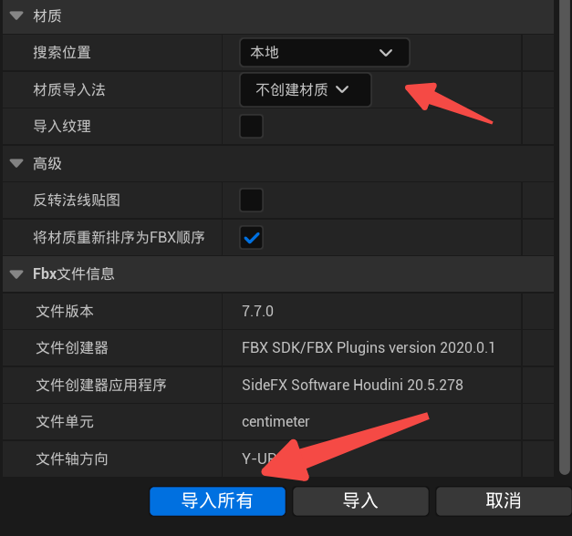
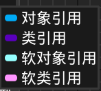

---

>### VAT 
>*不太理想 图片太大了*
>
>
>如果render不生效 改尺寸试试
>
>
>
>两个pass都导出一遍 然后将文件夹扔到ue中(包含fbx和所有tex的文件夹)
>
>
>
>导入注意选项
>
>| 导入注意选项 | 注意选项 2 |
>|-------|-------|
>|       |     |
>
>
>网格体操作
>
>
>纹理操作:
>| 全部设为hdr高精度 | 设为最近 |
>|-------|-------|
>|   |       |
>
>
>创建材质的uv数设为4方便tex使用 另外创建材质实例应用三张tex
>
>

---

>ue中实例是基于类创建的具体对象 类是一种模板，比如Actor类可以定义R Location Scale Material等等
>
>1. **对象引用**：用于引用具体的场景中的actor或对象，确保该对象在引用期间不被垃圾回收。
>2. **类引用**：用于引用类本身，通常用于动态生成该类的新实例或操作该类的元数据。
>3. **软对象引用**：用于引用场景中的对象，但不会阻止该对象被垃圾回收，比如蓝图中get 某个cube位置
>4. **软类引用**：用于引用类本身的软引用，适合用于延迟加载类资源，减少内存使用，并允许在运行时动态加载。
*垃圾回收（Garbage Collection）是自动管理内存的机制，用于检测和清除不再使用的对象，以释放内存资源，避免内存泄漏。*
 

- **`.ush` ≈ Unity中的`.cginc`（复用代码片段）。  
- **`.usf` ≈ Unity中的`.shader`（主要的Shader逻辑）。  
- **`.cpp`** 用于UE引擎的底层逻辑，与Unity的Shader逻辑分开，无直接对标。

>在Houdini中应用Ue的材质方法

Rebuild侧重于生成和更新几何体
Recook则侧重于执行计算以更新所有相关数据。

必开插件
* gltf
* actor palette

快捷键
ctrl b 打开选中资产的具体目录
alt 中键 改变中心点

定向光源要选择能与大气太阳光互动

>两者相乘需要＝1
